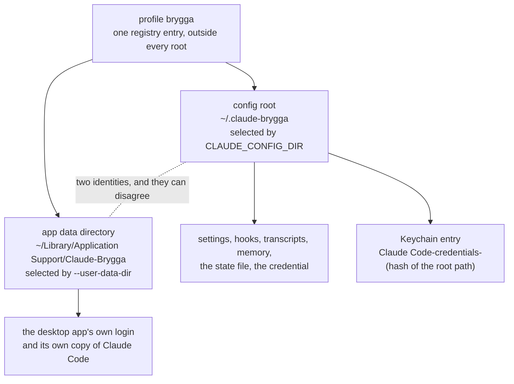

# Agent Profile Manager

`agent-profile`, installed as `agpin`, keeps several Claude accounts apart on
one Mac, and audits that the separation actually holds.

Claude Code has no built-in account switcher. The only mechanism for keeping
two accounts apart is giving each its own config root, selected by the
`CLAUDE_CONFIG_DIR` environment variable. Doing that by hand works right up
until it does not: a copy-paste slip labels one account's sessions as
another's, one root gets pinned to the *default* root and quietly overloads
it, and the desktop app never gets pinned at all. This tool removes the
hand-maintained duplication rather than adding a layer on top of it.

It is built for consultants with one account per customer. This page is the
front door: what a profile is, the five commands that set a machine up, and a
map of the guides. A coworker, or the coworker's own Claude Code session, sets
a Mac up from [the setup guide](docs/SETUP.md) without reading anything else.

## What a profile is

One profile is one account. It owns a config root, an app data directory and,
once the account has signed in, a Keychain entry keyed on the root's path.



| | |
| --- | --- |
| **Config root** | `~/.claude-<name>`, the value of `CLAUDE_CONFIG_DIR` |
| **App data dir** | `~/Library/Application Support/Claude-<Name>`, the value of `--user-data-dir` |

The config root holds everything the agent stores: settings, session
transcripts, auto memory, commands, skills, agents, plugins, plans, backups,
the credential and the state file. Two profiles therefore share no file at
all. Nothing is ever shared between two config roots, on purpose and without
exception; the reasoning is in
[Why nothing is shared](docs/DESIGN.md#why-nothing-is-shared). The one thing
this tool puts into a root is the registration for that root's own
[sessions server](docs/USE.md#the-sessions-server), which names the root and
nothing outside it.

The credential is keyed to the root path, which is why a root can never be
moved or renamed once it has a login, and why the app's own login and the
root its embedded Claude Code writes to are two identities that can disagree.
Both are explained in
[Three things that are not what they look like](docs/LIMITS.md#three-things-that-are-not-what-they-look-like).

It is named for agents rather than for Claude because the same problem will
arrive with ollama, codex and whatever comes next. Claude is the only agent
implemented today.

## Ten-minute start

Five steps, on a Mac with Claude Code already installed. Every output below
is generated from a real run of the tool, so what you see is what it prints.
The [setup guide](docs/SETUP.md) has the same steps with how to verify each
one, and the path for a machine that has already run unpinned.

**1. Install it.**

<!-- BEGIN GENERATED: example install (tools/gen-doc-examples.sh) -->
```sh
curl -fsSL https://raw.githubusercontent.com/mmsge/agent-profile-manager/hovud/tools/install.sh | bash
```

```
Asking which release is newest...
Downloading agent-profile-0.11.0.tar.gz
Checksum matches SHA256SUMS for v0.11.0.
Signature verified: built by the release workflow, from tag v0.11.0.
Unpacked v0.11.0 into /Users/alex/.local/share/agent-profile/0.11.0

Installed /Users/alex/.local/bin/agpin -> /Users/alex/.local/share/agent-profile/0.11.0/bin/agent-profile
Installed /Users/alex/.local/bin/agent-profile -> /Users/alex/.local/share/agent-profile/0.11.0/bin/agent-profile

WARNING: /Users/alex/.local/bin is not on your PATH, so the command will not be found.
Add this to your shell rc file:
  export PATH="/Users/alex/.local/bin:$PATH"

Next:
  agpin help
  agpin doctor
  agpin version --check

Worth adding to your shell rc file:
  eval "$(agpin guard)"      # refuse to run the agent unpinned
  eval "$(agpin completion bash)"  # tab-complete commands and profile names
  PROMPT='$(agpin which --label 2>/dev/null) %~ %# '
```
<!-- END GENERATED: example install -->

If `~/.local/bin` is already on your `PATH`, the warning is replaced by a line
saying so instead. On a Mac with the sessions server's dependencies to build,
two more lines say so before the links are made. Install `cosign` first if you
want the signature checked, and you do: `brew install cosign`. See
[Install](docs/INSTALL.md) for what is verified, `--prefix`, `--name` and
Homebrew.

**2. Create one profile per account.**

<!-- BEGIN GENERATED: example new (tools/gen-doc-examples.sh) -->
```sh
agpin new brygga
```

```
Created profile brygga
Sessions server: on (registered in /Users/alex/.claude-brygga/.claude.json)
Next: agpin run brygga   (it will ask you to log in)
```
<!-- END GENERATED: example new -->

Do that once per account, for example `agpin new havnelab`. Then sign in to
each: `agpin run brygga`, `agpin run havnelab`. `agpin new brygga --explain`
prints the long form: the root, the app data directory, and why the root
holds nothing from any other profile, which is the point. It has no settings,
no hooks and none of the guardrails your other profiles may have; set those up
in the new root directly, and do not copy them across. How a team gives every
new profile a baseline without copying is [issue #22](https://github.com/mmsge/agent-profile-manager/issues/22).

The sessions server line is the one thing `new` writes into a root: a
registration, made by Claude Code's own CLI, for a small read-only server over
that profile's own transcripts. [The sessions server](docs/USE.md#the-sessions-server)
says what it does and how to turn it off. If `claude` was not on your `PATH`
yet, `new` says so and `agpin mcp on brygga` does it later.

**3. Add these to your shell rc file.**

```sh
eval "$(agpin guard)"
eval "$(agpin completion bash)"   # or: completion zsh
PROMPT='$(agpin which --label 2>/dev/null) %~ %# '
```

The first refuses to run `claude` with nothing pinned. The second tab-completes
subcommands, flags and profile names. The third shows which profile a pinned
shell is using, so a prompt can never claim the wrong account. Open a new
shell, or `source` the rc file, before the next step.

fish uses `| source` rather than `eval "$(...)"`; see
[Completions](docs/USE.md#completions) and
[Refusing to run unpinned](docs/USE.md#refusing-to-run-unpinned) for the fish
forms of both.

**4. Check the separation actually holds.**

<!-- BEGIN GENERATED: example doctor-clean (tools/gen-doc-examples.sh) -->
```sh
agpin doctor
```

```
Orphaned Keychain entries were not checked (D12). Run "agpin doctor --keychain-scan" to check them.

No isolation problems found across 2 profile(s).
```
<!-- END GENERATED: example doctor-clean -->

The line about orphaned Keychain entries is not a finding: D12 is the one rule
that is off unless asked for, because it enumerates the whole login Keychain.
If `doctor` finds something instead, each finding names the rule and the
offender and says how to fix it; [The audit](docs/AUDIT.md) lists the rules,
and [Troubleshooting](docs/TROUBLESHOOTING.md) has every message with its
cause and fix.

**5. Pin the desktop app.**

<!-- BEGIN GENERATED: example app (tools/gen-doc-examples.sh) -->
```sh
agpin app brygga
```

```
Created /Users/alex/Applications/Claude-Brygga.app
Next: start a session in the app, then --explain shows how to confirm the pin.
```
<!-- END GENERATED: example app -->

Drag the generated `.app` into the Dock. Repeat per account, then run it again
any time to confirm nothing has drifted; a second run on an already-correct
applet says so rather than rebuilding it. `agpin app brygga --explain` shows
what the launcher pins and how to confirm it: start a Code session in the app
and run `find "$HOME"/.claude* -name "*.jsonl" -mmin -3`. The path it prints
is the root that is really in use.

That covers a clean machine. Most machines are not that: Claude Code has
usually been running unpinned for a while already, and the first `doctor` run
says so. [Adopting a machine that has run unpinned](docs/SETUP.md#part-2-a-machine-that-has-run-unpinned)
walks through what it reports and how each finding is resolved. `agpin` with
no arguments asks which profile and whether to open the terminal or the
desktop app, which is worth doing instead of typing the full command every
time; see [Just asking](docs/USE.md#just-asking).

## The guides

| Guide | Who it is for |
| --- | --- |
| [Setting up a Mac](docs/SETUP.md) | A person setting up their own machine, or a Claude Code session doing it for them. Every step with its command, the output to expect, and how to check it worked. Both the clean machine and the one that has run unpinned for months. |
| [Daily use](docs/USE.md) | Everyone, after setup. Every command, the guard, the picker, pinning a shell, completions, output levels and the sessions server. |
| [Install](docs/INSTALL.md) | Anyone deciding what to trust. The one-liner and what it verifies, Homebrew, the options, staying current, the development install and the Windows status. |
| [The desktop and the IDEs](docs/DESKTOP.md) | Anyone who opens Claude anywhere but a terminal. Which launch paths carry a pin, which leak, and which rule catches each. |
| [The audit](docs/AUDIT.md) | Anyone who has to prove the separation holds. The rules, what each one reads, the JSON document, `verify`, the leak test and the exit codes. |
| [What this does not protect against](docs/LIMITS.md) | A security-minded reader. Every gap that is still open, one honest paragraph each, and three things that are not what they look like. |
| [Troubleshooting](docs/TROUBLESHOOTING.md) | Anyone looking at a message. Every refusal and error the tool prints, with the cause and the fix. |
| [When an engagement ends](docs/OFFBOARDING.md) | Anyone retiring a profile. `remove`, `--purge`, what is never deleted for you, and the audit to hand over. |
| [Contributing](docs/CONTRIBUTING.md) | Anyone changing the tool. The tests, the three generators, CI, versioning and cutting a release. |
| [Design notes](docs/DESIGN.md) | The essays: why nothing is shared, a prompt that cannot lie, the audit rule by rule, one stream and two renderings, and what is deliberately not built. |
| [Verified facts](docs/FACTS.md) | The evidence. Every behaviour the tool depends on, how it was established and against which version. `verify` re-checks it. |
| [The audit schema](docs/AUDIT-SCHEMA.md) | The JSON document `doctor --json`, `list --json` and `verify --json` produce, field by field. |

`docs/proposals/` holds design proposals and `docs/reviews/` the reviews that
drove the last restructures; both are records rather than guides.

## Install

```sh
curl -fsSL https://raw.githubusercontent.com/mmsge/agent-profile-manager/hovud/tools/install.sh | bash
```

That downloads the newest tagged release, checks it against the `SHA256SUMS`
published beside it, checks the Sigstore signature if you have `cosign`,
unpacks it into `~/.local/share/agent-profile/<version>/` and links both
`agpin` and `agent-profile` at that copy. Or, with Homebrew:

```sh
brew tap mmsge/agpin
brew install agpin
```

No dependencies beyond a stock macOS for the tool itself: one bash 3.2 script,
with `python3` from the Command Line Tools used only to read JSON. What each
step trusts and verifies, the options, and the sessions server's Python
environment are in [Install](docs/INSTALL.md).

## Exit codes

| Code | Meaning |
| --- | --- |
| 0 | Success, nothing to report |
| 1 | Usage error, unknown profile or agent, missing dependency, `version --check` found a newer release, or `remove` was aborted or could not delete everything |
| 2 | `doctor` found an isolation problem |
| 3 | `verify` found an assumption that no longer holds |
| 4 | `verify` could not check something it wanted to check |

3 and 4 are deliberately different, so an unattended run can tell "your
isolation broke" apart from "I could not look".

## Licence

`agent-profile` is licensed under the GNU General Public License version 3 or
later (GPL-3.0-or-later). See `LICENSE` for the full text.

Use it on any machine, for any customer, for any purpose, free of charge. The
one condition is on redistribution: if you hand out a modified copy, or a
repackaged one, you must publish those modifications under the same licence.
