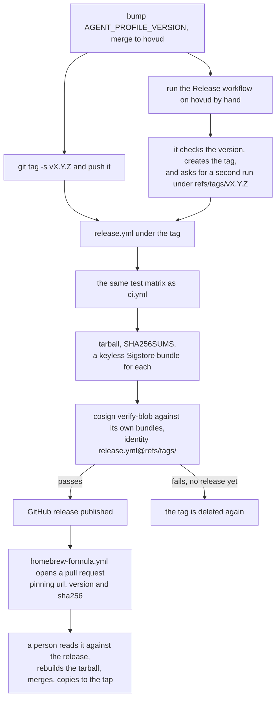

# Contributing

The tests, the three generators that keep the documentation honest, CI,
versioning, cutting a release, and what is deliberately not built. Nothing
here is needed to use the tool.

## Development

```sh
tests/run.sh              # 475 tests, no dependencies
shellcheck bin/agent-profile tools/*.sh tests/run.sh tests/cases/*.sh
tools/lint-bash32.sh      # refuse bash 4 constructs
tests/run.sh 75-ide       # one case file, by any part of its name
```

The sessions server under `server/` has its own tests, in Python, against
generated fixtures that contain no real transcript:

```sh
cd server && uv sync --frozen --group dev && uv run --frozen --group dev pytest -q
```

Its dependencies are pinned in `server/uv.lock`, and `server/requirements.txt`
is exported from it with hashes for the installer path that has no `uv`; run
the two commands at the end of [`server/README.md`](../server/README.md) after
changing either.

CI runs the suite on macOS under both `/bin/bash` (the real 3.2) and Homebrew's
latest bash, and on Ubuntu. Tests never touch a real config root: every path
the script resolves comes from `HOME` or an `AGENT_PROFILE_*` variable, and the
harness redirects all of them into a throwaway tree.

Versioning is semantic. `Z` for fixes, `Y` for backwards-compatible features,
`X` for breaking changes.

## The generators

Three things in the documentation are generated rather than typed, and CI
fails when any of them differs from what a regenerated one says. Never edit a
generated block by hand: run the generator and commit what it writes.

**The test count** in the Development section above. After adding or removing
tests, run `tools/gen-test-count.sh` and commit the change it makes to this
page. `tools/gen-test-count.sh --check` is what CI runs; it fails, naming both
the suite's count and this page's, if the two disagree. It runs the whole
suite and refuses to write while anything fails. Nobody has to compute the
number by hand again, which is what used to make this line collide between
branches that both added tests.

**The "What doctor reads" table** in [The audit](AUDIT.md#what-doctor-reads).
After changing what a rule reads, update the `# doctor reads (D07):` comment
beside it and run `tools/gen-doctor-reads.sh`, then commit the change it makes
to that page. The suite runs `tools/gen-doctor-reads.sh --check` against this
checkout, so a table that no longer matches the source fails there, naming the
rule rather than printing a diff. What goes in a declaration, and what the
table can and cannot promise because of it, is in
[What the table is derived from](AUDIT.md#what-the-table-is-derived-from).

**Every command example** in the README and the guides under `docs/`. Each sits
between two markers:

```markdown
<!-- BEGIN GENERATED: example new (tools/gen-doc-examples.sh) -->
```sh
agpin new brygga
```

```
Created profile brygga
Sessions server: on (registered in /Users/alex/.claude-brygga/.claude.json)
Next: agpin run brygga   (it will ask you to log in)
```
<!-- END GENERATED: example new -->
```

and `tools/gen-doc-examples.sh` fills the block from a real run of the tool in
a throwaway HOME: the command as the reader would type it, then what the tool
printed, with the throwaway path replaced by `/Users/alex` and the credential
hashes replaced by the ones that path would produce. Every scenario is a
function in that script, `ex_new` for the example `new`, and
`tools/gen-doc-examples.sh --list` names them all. The scenarios run as macOS
against stand-ins: a Keychain that knows only the services a scenario tells it
about, an empty Dock, an `osacompile` that stores lines verbatim, an `open`
that launches nothing, and a `claude` that only knows `mcp add` and `mcp
remove`. Nothing reads a real root, a real Keychain or a real Dock, and the
platform is pinned so a Mac and a Linux runner generate the same bytes.

After changing a message the documentation shows, run
`tools/gen-doc-examples.sh` and commit what it writes. CI runs the `--check`
form on all three legs; it fails naming the example and the file. To show a
new example, add a scenario function, put the markers where the example goes,
and run the generator. An example that cannot be generated, because it needs a
real terminal or a real Mac, is marked with an `<!-- illustrative: ... -->`
comment saying why, directly above its fence, and `tests/cases/95-examples.sh`
fails on an output fence that is neither generated nor marked.

Two more cases in the suite hold the documentation to the same standard.
`tests/cases/95-links.sh` resolves every relative link and anchor across
`README.md`, `docs/` and `packaging/`, using GitHub's anchor rules, so a
heading renamed on one page fails the link on another by name. And
`tests/cases/97-guidance.sh` checks that every file and every fact the tool's
own messages name still exists, which is why `docs/FACTS.md`,
`docs/DESIGN.md` and `docs/AUDIT-SCHEMA.md` keep their names and their
headings.

## Cutting a release

Bump `AGENT_PROFILE_VERSION` in `bin/agent-profile`, run
`tools/gen-doc-examples.sh` because the version appears in the generated
install examples, and merge that first. Then there are two ways to cut the
release, and they end in the same place.



**By tag, from a checkout.** This is the one to prefer.

```sh
git checkout hovud && git pull
git tag -s v0.10.0 -m "agent-profile 0.10.0"
git push origin v0.10.0
```

`-s` makes it a signed annotated tag, which needs a signing key configured;
`-a` makes an annotated one without a signature. A signed tag records who cut
the release, and the Sigstore bundle records what the workflow then built from
it. Those answer different questions, so do both.

**By hand, from the Actions tab.** Run the Release workflow on `hovud` and give
it the version without the leading `v`, for example `0.10.0`. This exists
because pushing a tag needs git write access to this repository, and whoever is
cutting the release does not always have it from where they are: a borrowed
machine, a phone, an agent working through an API that is scoped to branches.

That run builds nothing. It checks the version, creates the tag, pushes it, and
then asks for a second run of the same workflow on `refs/tags/<tag>`. The second
run is the release: it appears in the Actions tab under the tag rather than
under `hovud`, and it is the one to watch. A push made with `GITHUB_TOKEN`
starts no workflow run, which is why the second run is asked for by name rather
than following from the tag on its own.

Two runs rather than one because of what signs the artifacts. Keyless Sigstore
is an OIDC token exchanged for a short-lived certificate, and that token names
the ref the run was started from, not what the run checked out and not what it
tagged afterwards. A run started from `hovud` therefore signs as
`release.yml@refs/heads/hovud`, whatever it does next, and every verifier here
asks for `@refs/tags/`. Building under the tag is what makes the certificate
name the tag, and the workflow now runs `cosign verify-blob` against its own
bundles, with the identity and issuer `tools/install.sh` reads, before it
publishes anything.

What you give up by using it is the signed tag. The runner has no signing key,
and the fix for that would be a release key sitting in repository secrets,
which is a worse thing to own than an unsigned tag. So a manually cut tag is
annotated, created by `github-actions[bot]`, and says only that this workflow
made it. What the artifacts are is established the same way as on the tag path,
by the Sigstore certificate naming the workflow, the repository and the tag,
because the build that signs them runs under that tag. What is missing is the
separate record of which person decided to publish, and the Actions run log is
where that lives instead.

The manual path refuses to do three things, all of them before the tag exists.
It will not run from any branch but the default one, because a release built
from an unmerged branch would carry code that was never reviewed. It will not
move a tag that already exists, since whatever that tag points at has already
been downloaded and checksummed by somebody. And it will not accept a version
that disagrees with `AGENT_PROFILE_VERSION`, which is the same check the tag
path makes.

From either entry point the tag path in `.github/workflows/release.yml` does
the same work: it runs the same test matrix `ci.yml` runs, calling that
workflow rather than copying it, refuses the tag if it disagrees with
`AGENT_PROFILE_VERSION`, builds the tarball, writes `SHA256SUMS`, signs both
with keyless Sigstore, verifies both signatures against the identity
[Install](INSTALL.md#what-you-are-trusting-step-by-step) publishes, and only
then publishes the release.

The tag is therefore created before the build rather than after it, which is
the price of signing under it, and a failed run takes the tag back: when the
run fails and no release exists for the tag yet, the workflow deletes it,
rather than leaving a version number pointing at nothing anyone can install. A
tag that does have a release is never deleted, and neither is a tag that is not
a version, so pointing the workflow at some other tag by mistake cannot cost
you that tag. Nothing is lost either way: the manual run recreates its tag, and
a tag pushed from a checkout is still in your clone, so
`git push origin v0.10.0` puts it back unchanged, signature and all.

The tarball is built with fixed ownership, fixed order and the tagged commit's
own timestamp, so anyone can check the tag out, rebuild it and get the same
`sha256`. A checksum nobody can reproduce only says the file did not change in
transit.

The Homebrew formula then catches up on its own, to a point.
`.github/workflows/homebrew-formula.yml` runs once the release is published:
it reads the row for the tarball out of the release's own `SHA256SUMS`, hashes
the tarball it downloads from that same release to check the two agree,
verifies the Sigstore signature on both, and opens a pull request setting
`url`, `version` and `sha256` in `packaging/homebrew/agpin.rb` together. A
missing row or a sum the tarball does not have fails the job rather than
writing a formula nobody can install from.

A pull request, and never a push. The pin is worth having because somebody
looked at the release, so the mechanical half is what is automated and the
looking is not. Three things are still yours: read the pull request against
the release page, which is why its body names the release, the tarball and the
sum; rebuild the tarball from the tag and confirm the sum reproduces, which is
the check no runner can make for you; then merge it and copy the formula to
the tap. [`packaging/homebrew/README.md`](../packaging/homebrew/README.md) covers
that copy, and `tools/update-homebrew-formula.sh` is the same script by hand
if the run never happened.

The formula still cannot be updated before the release, because until it
exists there is no sum to pin.

## Status

macOS only. Both halves are implemented. A cross-platform port is
[issue #15](https://github.com/mmsge/agent-profile-manager/issues/15); [Windows](INSTALL.md#windows) has what it waits on.

The question that gated the desktop half is answered: the desktop app's
embedded Claude Code does honour `CLAUDE_CONFIG_DIR` from its process
environment, and `open --env` is what delivers it. That was established on a
real machine during two account migrations and confirmed twice, once per
account. The Keychain naming, the URL handler and the state-file questions are
answered too. The record is [`docs/FACTS.md`](FACTS.md).

Three things are deliberately not built yet: a per-root status line installer
(tamper-proof by construction, but it means writing inside a root, which this
tool does not do), `doctor --recent` as a standing command rather than
[the leak test](AUDIT.md#the-leak-test) you run by hand, and validation of what
a root's settings actually contain rather than just its layout. The reasoning
for each is in [Not built, and deliberately](DESIGN.md#not-built-and-deliberately).
