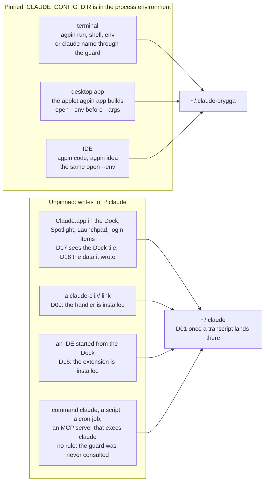

# The desktop and the IDEs

Where a pin comes from outside a terminal, and where it does not. The
terminal is pinned by an exported variable; everything else has to get the
same variable into a process the shell never started. Every output shown is
generated from a real run of the tool.

## The launch paths

The picture below is the whole page in one drawing. Three launch paths carry
a pin. Every other way of starting Claude leaks to the default root, and each
leak has the `doctor` rule that catches it, or the honest note that no rule
can.



## The desktop

The desktop app takes its config root from its process environment, and macOS
`open` puts it there:

```sh
open -n -a /Applications/Claude.app \
    --env CLAUDE_CONFIG_DIR=~/.claude-brygga \
    --args --user-data-dir=~/Library/Application\ Support/Claude-Brygga
```

**`--env` must come before `--args`.** Everything after `--args` is handed to
the application rather than to `open`, so an `--env` on the wrong side of it
produces a launch line that reads correctly, contains every right string, and
pins nothing.

```sh
agpin desktop brygga          # launch it pinned, once
agpin app brygga              # or build a launcher you can keep
agpin app brygga --icon ~/icons/brygga.png
```

`app` puts that command inside an AppleScript applet, so the profile has a Dock
icon that cannot launch unpinned:

<!-- BEGIN GENERATED: example app (tools/gen-doc-examples.sh) -->
```sh
agpin app brygga
```

```
Created /Users/alex/Applications/Claude-Brygga.app
Next: start a session in the app, then --explain shows how to confirm the pin.
```
<!-- END GENERATED: example app -->

Run it again and it repairs the launch line in place, keeping the icon; if
there was nothing to repair it says so, because "already applied" and "never
worked" must not look the same. With `--explain` it shows what the launcher
pins and how to confirm the pin actually took:

<!-- BEGIN GENERATED: example app-explain (tools/gen-doc-examples.sh) -->
```sh
agpin app brygga --explain
```

```
/Users/alex/Applications/Claude-Brygga.app is already correct.
  pins      CLAUDE_CONFIG_DIR=/Users/alex/.claude-brygga
  app data  /Users/alex/Library/Application Support/Claude-Brygga
Nothing to do. This is what an applied change looks like on a second run;
it is not the same as one that never worked.

Confirm it actually pins, by starting a Code session in the app and running:
  find "$HOME"/.claude* -name "*.jsonl" -mmin -3
The path it prints is the root that is really in use.
```
<!-- END GENERATED: example app-explain -->

**Your launchers do not have to live in `~/Applications`.** Before falling back
to the conventional path, `app` searches for one that already pins this
profile's root and adopts it, saying plainly that it found rather than created
it. If two launchers pin the same root it refuses and asks which, rather than
rewriting a file you did not name; that message is in
[Troubleshooting](TROUBLESHOOTING.md). `--applet` always wins over the search.

`--icon` takes a 1024px PNG and installs it through `sips` and `iconutil`. It
keeps the applet's original icon once, and never replaces that backup on a
later run. At Dock size a word is illegible: one large initial and a distinct
colour per account is what actually reads.

Two things this tool will not do, both because they do not work. It will not
build a `.app` whose executable is a shell script: such a bundle has no Mach-O
header, so macOS cannot determine its architecture and the Dock icon bounces
forever. And it will not run the app binary from your shell: Electron inherits
the terminal's stdin, and the app dies with the shell.

A profile has two identities that can disagree with each other, the app's own
login and the config root its embedded Claude Code writes to; see
[Two identities, and they can disagree](DESIGN.md#two-identities-and-they-can-disagree).
The desktop app renders no status line of its own, so there is nothing inside
it that says which root it is using. For the desktop, the launcher is the
guarantee, `doctor`'s D13 is the check, and
[the leak test](AUDIT.md#the-leak-test) settles any argument.

The applet carries the root and the app data directory, and nothing else.
In particular it never carries the agent teams switch that `agpin teams`
turns on for a profile's terminal and IDE sessions, because the desktop app
has no agent teams: the Claude Code documentation says they "are available in
the CLI, not in Desktop", and [F26](FACTS.md#f26-agent-teams-are-one-variable-and-the-desktop-app-has-none)
quotes it. A launcher carrying a variable the app ignores would claim more
than it does, and D13 reads that line. [Agent teams](USE.md#agent-teams) has
the switch.

Put the applet, not the app, in the Dock and in the login items. `doctor`'s
D17 reports the app's own icon sitting in the Dock and D18 reports the default
app data directory once such a launch has written to it, but neither can see
the login items: listing those needs root or an Automation consent dialogue,
and `docs/FACTS.md` F22 records why.

## The IDEs

An IDE extension is the launch path nobody watches. It starts a Claude Code
session from inside the editor, so your shell never runs, the `guard` function
is never consulted, and no applet is involved. What the session gets is
whatever the IDE's own process environment holds, and an IDE opened from the
Dock, Spotlight, Launchpad or a login item holds no `CLAUDE_CONFIG_DIR` at all.

```sh
agpin code brygga ~/src/some-project      # VS Code
agpin code brygga ~/src/x --app Cursor    # Cursor, same family
agpin idea brygga ~/src/some-project      # IntelliJ IDEA
agpin idea brygga --app PyCharm           # any JetBrains IDE
```

These are the same mechanism as `desktop`, `open --env` in front of `--args`,
and for the same reason: the pin has to be in the process environment and
nothing else puts it there.

**They refuse when that editor is already running,** and this is the part worth
understanding, because it was found the hard way. `open -n` stops LaunchServices
handing your folder to the running application, but a VS Code started that way
still finds the older instance over its own socket, gives it the folder and
exits. The window you get back belongs to that older process and carries
whatever root it was started with. Tested on a Mac: two windows, opened from
two different profiles, both writing to the first profile's root. It looked
right and it was wrong, which is the one outcome this tool must not produce, so
the command now refuses rather than hands you that window.

Two ways past it:

```sh
# quit the editor, then launch as normal
agpin code brygga ~/src/some-project

# or start a genuinely separate instance, which can be pinned whatever is open
agpin code brygga ~/src/some-project --new-instance
```

`--new-instance` gives that instance its own `--user-data-dir`, which is what
stops it being forwarded to. Its settings and window state live under the
profile's app data directory, so they are that customer's and `remove --purge`
takes them with everything else. Extensions are not part of user data and stay
shared, so the Claude Code extension does not need installing again per
profile. There is no `--new-instance` for `idea`: a JetBrains IDE has no
equivalent, so quitting it is the only way.

`--user-data-dir` is a VS Code family flag, so `--new-instance` is refused for
an `--app` outside that family, naming the editors it is known for. An editor
that ignored the flag would open a window that shares its state, which is the
thing `--new-instance` exists to avoid. Without the flag, `--app` still names
any editor at all: `open --env` pins whatever it launches.

If the check cannot tell whether the editor is running, it refuses too. Being
told to quit an editor that was already closed costs a moment; a session
silently writing into another customer's root costs rather more.

**`doctor` reports an installed extension as D16 every time.** Nothing on disk
records how an IDE was launched, so the rule cannot know whether this one was
pinned, and a rule that guessed would be worse than one that says what it
found. Treat D16 the way you treat D09: a launch path that exists, with a
supported way to use it safely. When VS Code keeps the previous version of
the extension on disk after an update, the rule fires once per version today;
[issue #58](https://github.com/mmsge/agent-profile-manager/issues/58) is the change to one finding naming both paths.

The two families are not the same underneath, and the finding says so. The VS
Code extension bundles its own copy of Claude Code and spawns it from the
extension host, so no rc file is ever read and a shell guard cannot see it. The
JetBrains plugin bundles nothing: it types `claude` into the IDE's integrated
terminal, so your rc file does run and your guard does see that call. What it
still cannot fix is the root the IDE process started with.

**Do not pin an IDE with the extension's own settings.** VS Code's
`claudeCode.environmentVariables` reaches the agent the extension spawns but
not the extension's own config home, so half of it moves and half of it does
not. The JetBrains plugin's **Config directory** setting looks like a pin and
is not one: it only chooses where the plugin writes its lock file. The full
reading of both, with the code each claim comes from, is
[F19 to F21](FACTS.md#ide-extensions).

If an IDE extension is installed, [the leak test](AUDIT.md#the-leak-test)
settles it there too. Launch with `agpin code <name> <path>`, start a session,
and run the `find`; then launch the same IDE from the Dock and run it again.
The two answers should differ, and if they stop differing, F19 has changed and
D16's advice is wrong.
