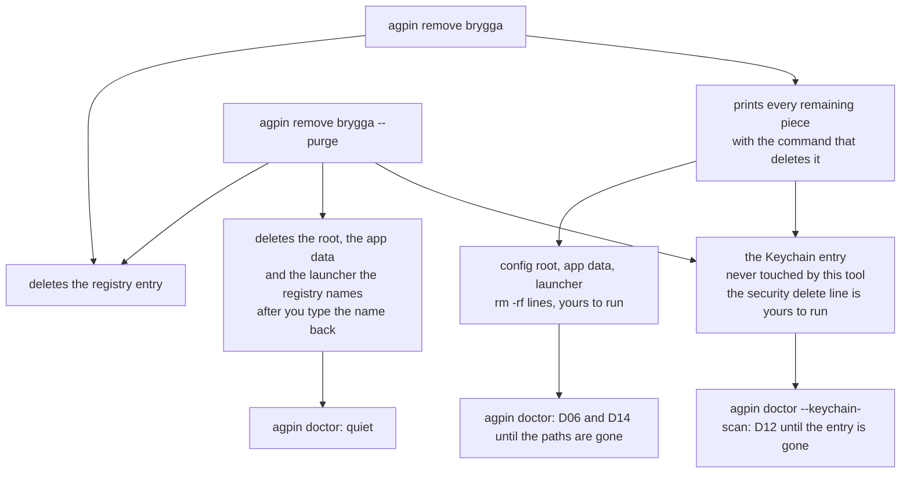

# When an engagement ends

Engagements end, and the customer's data has to leave the laptop. The
machinery that kept that account separate is exactly what makes it hard to
find: a config root, an app data directory, a Dock launcher and a Keychain
entry, in four different places, none of them named after the customer.
Deleting a registry file by hand and then hunting for the rest is how a
transcript survives on a machine for another two years. Every output shown is
generated from a real run of the tool.



## remove

`remove` does the finding. With no flags it deletes the registry entry, nothing
else, and prints every remaining piece with the command that deletes it:

<!-- BEGIN GENERATED: example remove (tools/gen-doc-examples.sh) -->
```sh
agpin remove brygga
```

```
Unregistered brygga

Left on this machine:

  config root  /Users/alex/.claude-brygga
               3 session(s)
               rm -rf '/Users/alex/.claude-brygga'

  app data     /Users/alex/Library/Application Support/Claude-Brygga
               rm -rf '/Users/alex/Library/Application Support/Claude-Brygga'

  launcher     /Users/alex/Applications/Claude-Brygga.app
               rm -rf '/Users/alex/Applications/Claude-Brygga.app'

  credential   Claude Code-credentials-f241ebcd
               This tool never touches credentials, so this one is yours to delete.
               Until it is gone, doctor --keychain-scan counts it as a D12 orphan.
               security delete-generic-password -s 'Claude Code-credentials-f241ebcd' -a 'alex'

The registry entry is gone, so this command cannot look those paths up again.
The list above is the whole record of them.

Then run: agpin doctor
A root no profile claims is D06 and a launcher no profile claims is D14, so
both go quiet once those paths are gone.
```
<!-- END GENERATED: example remove -->

The credential is never touched, in either form. This tool does not read, write
or delete credentials, and the command that ends an engagement is the last
place to start. On macOS the credential is a Keychain entry, so it prints the
`security delete-generic-password` line and leaves running it to you. Where
there is no Keychain the credential is a `.credentials.json` file inside the
root instead, and it prints the `rm` that deletes that file. A machine with
neither is told about neither: naming a Keychain service that cannot exist
there would send you looking for something that was never on your disk.

## remove --purge

`--purge` does the deleting for you, for the root, the app data directory and
the launcher:

<!-- BEGIN GENERATED: example remove-purge (tools/gen-doc-examples.sh) -->
```sh
agpin remove brygga --purge
```

```
Purging profile brygga. This permanently deletes:

  config root  /Users/alex/.claude-brygga
               3 session(s)
  app data     /Users/alex/Library/Application Support/Claude-Brygga
  launcher     /Users/alex/Applications/Claude-Brygga.app
  registry     /Users/alex/.config/agent-profiles/brygga.conf

The credential is not listed above, and never will be: this tool never
touches credentials. The command that deletes it is printed at the end.

This cannot be undone. Type the profile name to confirm: 
Deleted /Users/alex/.claude-brygga
Deleted /Users/alex/Library/Application Support/Claude-Brygga
Deleted /Users/alex/Applications/Claude-Brygga.app

Unregistered brygga

Left on this machine:

  credential   Claude Code-credentials-f241ebcd
               This tool never touches credentials, so this one is yours to delete.
               Until it is gone, doctor --keychain-scan counts it as a D12 orphan.
               security delete-generic-password -s 'Claude Code-credentials-f241ebcd' -a 'alex'

Then run: agpin doctor
A root no profile claims is D06 and a launcher no profile claims is D14, so
both go quiet once those paths are gone.
```
<!-- END GENERATED: example remove-purge -->

It lists what it is about to delete, then asks you to type the profile name
back; the name typed at the prompt is not shown above. Anything else aborts
having deleted nothing, and a prefix of the name is not the name. It refuses
outright when stdin is not a terminal, so no script can purge and no pipeline
can answer the question for you.

It deletes only what that profile's own registry entry names, exactly as it
names it. A symlink is refused rather than followed, because what it points at
was never this profile's. A root two profiles claim is refused, because it
holds more than the account you are retiring. A launcher the registry does not
name is refused too: where a launcher would conventionally be is a guess, and a
guess is not something to delete. Everything it declines is printed with the
reason and the command, so nothing is silently retained.

The one thing it never deletes is the credential. A root that holds a
`.credentials.json`, which is where the login lives on every platform without
a Keychain, is emptied rather than deleted: everything around that file goes,
the file is left exactly where it was, and the root stays around it because
the file cannot be moved. The screen says so before it asks you to type the
name, and the closing list names the file and the `rm` that deletes it, the
same way it names the Keychain entry on a Mac. Deleting it is your decision
and your command, on every platform.

## Then audit what is left

A root no profile claims is D06 and a launcher no profile claims is D14, so
after `remove` on its own both of those are waiting for you:

<!-- BEGIN GENERATED: example doctor-after-remove (tools/gen-doc-examples.sh) -->
```sh
agpin doctor
```

```
D06  a claude config root exists that no profile claims
     /Users/alex/.claude-brygga
     Register it, or remove it if it is left over.
     Unregistered roots are invisible to every other check here.

D14  a claude desktop launcher exists that no profile claims
     /Users/alex/Applications/Claude-Brygga.app
     It pins /Users/alex/.claude-brygga, which no registered
     profile owns. Register that root first with agpin new,
     then point a profile at this launcher with agpin app --applet.
     Until then nothing here audits what it launches.

Orphaned Keychain entries were not checked (D12). Run "agpin doctor --keychain-scan" to check them.

2 finding(s).
```
<!-- END GENERATED: example doctor-after-remove -->

After a purge both are quiet. D12 is the one that stays, and it is also the
one you have to ask for: the Keychain scan is opt-in, so plain `doctor` never
enumerates the Keychain and never reports it. Run `agpin doctor
--keychain-scan` for that rule. It counts Keychain entries whose suffix
matches no root on this machine, and the retired profile's entry is now
exactly that. The suffix is a one-way hash, so nothing can trace it back to a
path or delete it for you; run the printed `security` command and D12 goes
quiet on the next run. Today the finding is a count; [issue #61](https://github.com/mmsge/agent-profile-manager/issues/61)
is the change that dates the entries, so a reader can tell dead ones from
live ones. Leaving it is harmless, and it is also a credential for
an account you no longer work for, sitting in your Keychain.

## Then, if the customer wants it in writing

<!-- BEGIN GENERATED: example doctor-report (tools/gen-doc-examples.sh) -->
```sh
agpin doctor --report ~/audits/brygga-2026-09-08
```

```
Orphaned Keychain entries were not checked (D12). Run "agpin doctor --keychain-scan" to check them.

No isolation problems found across 2 profile(s).
Not every rule ran here: D17 was limited.
Run "agpin doctor --json" for the reason under each.
Created /Users/alex/audits
Wrote /Users/alex/audits/brygga-2026-09-08.json
Wrote /Users/alex/audits/brygga-2026-09-08.md
```
<!-- END GENERATED: example doctor-report -->

That writes a dated audit of the machine twice, `brygga-2026-09-08.json` and
`brygga-2026-09-08.md`, from one run. The Markdown is the one to send: it names
the host, the user, the tool version, the agent version and the time, lists
every profile still on the machine, and gives every rule with a status each,
including the ones that did not run and why. It is the answer to a security
officer asking whether their data was kept apart on a consultant's laptop,
which until now could only be a screenshot of prose. The document's fields
are in [the audit schema](AUDIT-SCHEMA.md).
