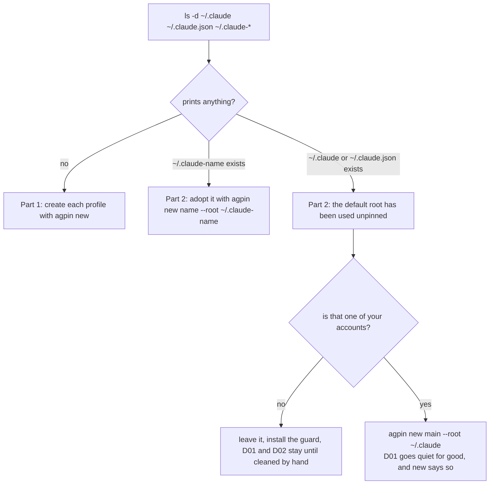

# Setting up a Mac

This guide takes one Mac from nothing to a working, audited set of profiles,
one per account. It is written for two readers: a person setting up their
own machine, and a Claude Code session doing it for that person. Every step
has the exact command, the output to expect, how to check it worked, and a
note wherever a human has to act. Every output shown is generated from a real
run of the tool, so it is what the tool prints today.

Read [What a profile is](../README.md#what-a-profile-is) first if the words
config root, app data directory and pin are new. Then follow
[Part 1](#part-1-a-clean-machine) top to bottom. If Claude Code has already
been run on this Mac, and on most Macs it has, follow
[Part 2](#part-2-a-machine-that-has-run-unpinned) as well.

## If you are an agent doing this for someone

You are a Claude Code session, and the person has asked you to set up their
profiles. Hold to these, in this order of importance.

- **Never copy anything between config roots.** No settings, no hooks, no
  skills, no commands, no memory, no `settings.json`, no template. A new root
  is empty on purpose, and a copied file is a file that drifts. If the person
  wants their hooks in the new profile, tell them to set them up in that root
  directly, and say why:
  [Why nothing is shared](DESIGN.md#why-nothing-is-shared). A company
  baseline that every new profile gets without copying is an open decision,
  [issue #22](https://github.com/mmsge/agent-profile-manager/issues/22); until it lands, the
  answer is to set the root up by hand.
- **Never touch the Keychain.** Do not run `security` to read, list or delete
  anything. The only Keychain command in this documentation is the delete
  line `remove` prints when an engagement ends, and running it is the
  person's decision, not yours.
- **Never run the agent unpinned.** `command claude` is the guard's
  documented escape hatch; do not use it. If a command refuses, read the
  refusal and pin, do not bypass.
- **Never pick the profile names or decide which account is which.** Ask.
  A profile name is permanent: a config root cannot be moved or renamed once
  it has a login, because the credential is keyed to the root's path, and the
  name is in the path. Get the list of accounts and the name for each from
  the person before the first `agpin new`.
- **Stop at every login.** `agpin run <name>` starts Claude Code pinned to
  that profile, and Claude Code asks the person to log in through a browser.
  You cannot do that for them. Hand over, wait, and verify with `agpin list`
  afterwards.
- **Stop at the Dock and at System Settings.** Dragging the generated applet
  into the Dock, and adding it to the login items, are the person's to do.
  Say which file, and what to check afterwards.
- **Read every `doctor` finding before acting on it.** Each names a rule, the
  offending path and the fix. The fix is often a command; sometimes it is a
  decision the person has to make, and Part 2 says which is which.

One fact about yourself. A Claude Code session writes a transcript of itself
into its own config root as it runs. If this session was started with nothing
pinned, that transcript is landing in the default root, `~/.claude`, right
now, and `doctor` will report it as D01 the moment a profile is registered.
Run the setup from a pinned shell, `agpin shell <name>`, once a profile
exists for the account this session is logged into, or expect that D01
finding and know why it is there. Say so in your report either way.

When you are done, run `agpin doctor` and `agpin list` and put both outputs in
your report, unedited.

## Before you start

Check each of these. The command beside it is how.

| Need | Check |
| --- | --- |
| A Mac. The tool is macOS only; see [Windows](INSTALL.md#windows). | `uname` prints `Darwin` |
| Claude Code installed, with `claude` on `PATH` | `command -v claude` prints a path |
| Claude Desktop, if the desktop app is to be pinned | `ls /Applications/Claude.app` |
| `python3`, which every command that reads JSON uses | `python3 --version` prints one; `xcode-select --install` if it does not |
| `cosign`, so the installer can check the release signature | `brew install cosign` |
| `uv`, so the sessions server's environment builds without the Command Line Tools dialogue | `brew install uv` |
| The list of accounts, and a profile name for each | Ask. Letters, digits, dash and underscore only |

Then decide which path you are on:

```sh
ls -d ~/.claude ~/.claude.json ~/.claude-* 2>/dev/null
```

If that prints nothing, this is a clean machine: follow Part 1 and stop. If it
prints `~/.claude` or `~/.claude.json`, Claude Code has run unpinned here, and
if it prints a `~/.claude-<something>` directory, someone has already made a
root by hand. Follow Part 1, then Part 2.



## Part 1: a clean machine

### Step 1. Install the tool

Where a human acts: nowhere, unless `~/.local/bin` is not on `PATH` yet.

<!-- BEGIN GENERATED: example install (tools/gen-doc-examples.sh) -->
```sh
curl -fsSL https://raw.githubusercontent.com/mmsge/agent-profile-manager/hovud/tools/install.sh | bash
```

```
Asking which release is newest...
Downloading agent-profile-0.11.0.tar.gz
Checksum matches SHA256SUMS for v0.11.0.
Signature verified: built by the release workflow, from tag v0.11.0.
Unpacked v0.11.0 into /Users/alex/.local/share/agent-profile/0.11.0

Installed /Users/alex/.local/bin/agpin -> /Users/alex/.local/share/agent-profile/0.11.0/bin/agent-profile
Installed /Users/alex/.local/bin/agent-profile -> /Users/alex/.local/share/agent-profile/0.11.0/bin/agent-profile

WARNING: /Users/alex/.local/bin is not on your PATH, so the command will not be found.
Add this to your shell rc file:
  export PATH="/Users/alex/.local/bin:$PATH"

Next:
  agpin help
  agpin doctor
  agpin version --check

Worth adding to your shell rc file:
  eval "$(agpin guard)"      # refuse to run the agent unpinned
  eval "$(agpin completion bash)"  # tab-complete commands and profile names
  PROMPT='$(agpin which --label 2>/dev/null) %~ %# '
```
<!-- END GENERATED: example install -->

If `~/.local/bin` is already on your `PATH`, the warning is replaced by a line
saying so. On a Mac with the sessions server's dependencies to build, the
lines `Building the sessions server's environment with uv, from server/uv.lock ...`
and `Built .../server/.venv` appear before the links are made; without `uv`
the installer says it will use `python3` instead, and why that opens the
Command Line Tools dialogue. If the `WARNING` about `PATH` appeared, add the
`export PATH` line it printed to the shell rc file and open a new shell.

Without `cosign` the checksum is still checked, and the installer says
loudly what went unverified; [Install](INSTALL.md) has that output and what
each step trusts.

Check it worked:

<!-- BEGIN GENERATED: example version (tools/gen-doc-examples.sh) -->
```sh
agpin version
```

```
agpin 0.11.0
GPL-3.0-or-later
```
<!-- END GENERATED: example version -->

### Step 2. Create one profile per account

Where a human acts: choosing the names. One profile per account, named for
the customer, never for the person.

<!-- BEGIN GENERATED: example new (tools/gen-doc-examples.sh) -->
```sh
agpin new brygga
```

```
Created profile brygga
Sessions server: on (registered in /Users/alex/.claude-brygga/.claude.json)
Next: agpin run brygga   (it will ask you to log in)
```
<!-- END GENERATED: example new -->

Repeat for every account: `agpin new havnelab`, and so on. The long form,
with `--explain`, says what was made and why it holds nothing:

<!-- BEGIN GENERATED: example new-explain (tools/gen-doc-examples.sh) -->
```sh
agpin new brygga --explain
```

```
Created profile brygga
  agent     claude
  root      /Users/alex/.claude-brygga
  app data  /Users/alex/Library/Application Support/Claude-Brygga

Sessions server: on (registered in /Users/alex/.claude-brygga/.claude.json)

The root holds nothing from any other profile, which is the point: nothing is
shared between profiles. That also means it has no settings, no hooks and
none of the guardrails your other profiles may have. Set those up here
directly; do not copy them across.

Next: agpin run brygga   (it will ask you to log in)
```
<!-- END GENERATED: example new-explain -->

The sessions server line is the one thing `new` writes into the root: a
registration, made by Claude Code's own CLI, for a small read-only server over
that profile's own transcripts. If `claude` is not on `PATH` yet, `new` says
so and the registration can be made later:

<!-- BEGIN GENERATED: example new-no-claude (tools/gen-doc-examples.sh) -->
```sh
agpin new brygga
```

```
Created profile brygga
Sessions server: not registered, because claude is not on PATH.
  Once it is:  agpin mcp on brygga
Next: agpin run brygga   (it will ask you to log in)
```
<!-- END GENERATED: example new-no-claude -->

Running `new` again for a name that exists is safe and says so; running it
with a different `--root` is refused, because that would invalidate the
login. Both messages are in [Troubleshooting](TROUBLESHOOTING.md).

Check it worked. Every profile is listed, with no account yet:

<!-- BEGIN GENERATED: example list-fresh (tools/gen-doc-examples.sh) -->
```sh
agpin list
```

```
brygga
  agent     claude
  root      /Users/alex/.claude-brygga
  account   (not signed in)
  sessions  0
  mcp       on

havnelab
  agent     claude
  root      /Users/alex/.claude-havnelab
  account   (not signed in)
  sessions  0
  mcp       on

```
<!-- END GENERATED: example list-fresh -->

### Step 3. Sign in to each profile

Where a human acts: here, once per profile. This is the step an agent hands
over.

```sh
agpin run brygga
```

That starts Claude Code with `CLAUDE_CONFIG_DIR` set to the profile's root.
Claude Code finds no login there and asks for one, in the browser. Log in with
the account this profile is for, then exit Claude Code. Repeat for each
profile: `agpin run havnelab`.

Check it worked. Each profile now names its account:

<!-- BEGIN GENERATED: example list (tools/gen-doc-examples.sh) -->
```sh
agpin list
```

```
brygga
  agent     claude
  root      /Users/alex/.claude-brygga
  account   alex@brygga.example
  org       org-brygga
  sessions  1
  mcp       on

havnelab
  agent     claude
  root      /Users/alex/.claude-havnelab
  account   alex@havnelab.example
  org       org-havnelab
  sessions  1
  mcp       on

```
<!-- END GENERATED: example list -->

The account line is read from the profile's own state file, the same
identity `doctor` uses. If a profile shows the wrong account, the person
logged in with the wrong one: sign out inside Claude Code, run
`agpin run <name>` again and log in with the right one. Do not move or rename
the root to fix it; that invalidates the login.

### Step 4. Add the guard, completions and the prompt label to the shell

Where a human acts: editing their rc file, or agreeing to have it edited.

Add these lines to `~/.zshrc`, or `~/.bashrc`:

```sh
eval "$(agpin guard)"
eval "$(agpin completion bash)"   # or: completion zsh
PROMPT='$(agpin which --label 2>/dev/null) %~ %# '
```

The first refuses to run `claude` with nothing pinned. The second
tab-completes subcommands, flags and profile names. The third shows which
profile a pinned shell is using, so a prompt can never claim the wrong
account. In fish, in `~/.config/fish/config.fish`:

```fish
agpin guard --shell fish | source
agpin completion fish | source
function fish_prompt
    set -l p (agpin which --label 2>/dev/null)
    echo -n "$p "(prompt_pwd)'> '
end
```

Open a new shell, or `source` the rc file. Check it worked, in three parts.
A shell that is not pinned says so:

<!-- BEGIN GENERATED: example which-unpinned (tools/gen-doc-examples.sh) -->
```sh
agpin which
```

```
Not pinned to any profile.
Pin with: eval "$(agpin env <profile>)"
```
<!-- END GENERATED: example which-unpinned -->

Running `claude` in it is refused:

<!-- BEGIN GENERATED: example guard-refusal (tools/gen-doc-examples.sh) -->
```sh
eval "$(agpin guard)"
claude
```

```
Refusing to run claude unpinned.
Nothing is pinned, so this would write to the default root,
under whichever account last logged in there.

Name one to use it, for example: claude <profile> [args...]

Profiles on this machine:
  brygga
  havnelab

Or pin the shell: eval "$(agpin env <profile>)"
Override:         command claude [args...]
```
<!-- END GENERATED: example guard-refusal -->

And a pinned shell names its profile:

<!-- BEGIN GENERATED: example which-pinned (tools/gen-doc-examples.sh) -->
```sh
eval "$(agpin env brygga)"
agpin which
```

```
Pinned to brygga
  agent     claude
  CLAUDE_CONFIG_DIR=/Users/alex/.claude-brygga
  profile   brygga
```
<!-- END GENERATED: example which-pinned -->

`claude brygga` is the everyday form: with the guard on, a leading profile
name pins and runs. [Daily use](USE.md) covers `shell`, `env`, the picker and
the rest.

### Step 5. Audit the separation

Where a human acts: nowhere. This is the step to run after every change, and
the one to put in a report.

<!-- BEGIN GENERATED: example doctor-clean (tools/gen-doc-examples.sh) -->
```sh
agpin doctor
```

```
Orphaned Keychain entries were not checked (D12). Run "agpin doctor --keychain-scan" to check them.

No isolation problems found across 2 profile(s).
```
<!-- END GENERATED: example doctor-clean -->

The line about orphaned Keychain entries is not a finding: D12 is the one
rule that is off unless asked for, because it enumerates the whole login
Keychain. `agpin doctor --keychain-scan` runs it.

On a clean machine where step 3 was skipped, `doctor` says which profiles
have not signed in yet, and that is the fix:

<!-- BEGIN GENERATED: example doctor-fresh (tools/gen-doc-examples.sh) -->
```sh
agpin doctor
```

```
D05  profile 'brygga' has no credential
     /Users/alex/.claude-brygga
     No Keychain entry 'Claude Code-credentials-f241ebcd' and no .credentials.json.
     Sign in with: agpin run brygga

D05  profile 'havnelab' has no credential
     /Users/alex/.claude-havnelab
     No Keychain entry 'Claude Code-credentials-a32c689c' and no .credentials.json.
     Sign in with: agpin run havnelab

Orphaned Keychain entries were not checked (D12). Run "agpin doctor --keychain-scan" to check them.

2 finding(s).
```
<!-- END GENERATED: example doctor-fresh -->

Anything else it reports on a machine that was clean before step 1 means
something ran unpinned between the steps, which is what Part 2 is about.
[The audit](AUDIT.md) lists every rule.

### Step 6. Pin the desktop app

Where a human acts: dragging the applet into the Dock, and the login items.
Skip this step if Claude Desktop is not installed.

<!-- BEGIN GENERATED: example app (tools/gen-doc-examples.sh) -->
```sh
agpin app brygga
```

```
Created /Users/alex/Applications/Claude-Brygga.app
Next: start a session in the app, then --explain shows how to confirm the pin.
```
<!-- END GENERATED: example app -->

Repeat per account. Then, the human part: open `~/Applications` in the Finder
and drag `Claude-Brygga.app` into the Dock. If the desktop app should start at
login, add the applet, never `Claude.app` itself, under System Settings,
General, Login Items. The app's own icon must not be in the Dock or the login
items at all, because a click on it launches the app unpinned; `doctor`
reports the Dock tile as D17.

Check it worked, twice. First the launcher itself:

<!-- BEGIN GENERATED: example app-explain (tools/gen-doc-examples.sh) -->
```sh
agpin app brygga --explain
```

```
/Users/alex/Applications/Claude-Brygga.app is already correct.
  pins      CLAUDE_CONFIG_DIR=/Users/alex/.claude-brygga
  app data  /Users/alex/Library/Application Support/Claude-Brygga
Nothing to do. This is what an applied change looks like on a second run;
it is not the same as one that never worked.

Confirm it actually pins, by starting a Code session in the app and running:
  find "$HOME"/.claude* -name "*.jsonl" -mmin -3
The path it prints is the root that is really in use.
```
<!-- END GENERATED: example app-explain -->

Then the leak test it names. Click the applet, start a Code session in the
app, and within three minutes run:

```sh
find "$HOME"/.claude* -name '*.jsonl' -mmin -3
```

The path it prints is the root that is really in use. It must be under
`~/.claude-brygga`. If it is under `~/.claude`, the app was launched some
other way than through the applet; see
[The desktop and the IDEs](DESKTOP.md).

A profile has two identities that can disagree: the account the app shows in
its own window, and the root its embedded Claude Code writes to. The app
naming the right account is not evidence of anything. The leak test is.

### Step 7. Pin the IDEs, if any

Where a human acts: quitting the editor first, if it is running.

An IDE extension takes its config root from the IDE's own process
environment, so an IDE started from the Dock or Spotlight runs its Claude
Code extension unpinned. The only launches that carry a pin are:

```sh
agpin code brygga ~/src/some-project      # VS Code, or --app Cursor
agpin idea brygga ~/src/some-project      # IntelliJ IDEA, or --app PyCharm
```

Both refuse when that editor is already running, because the window would
belong to the running process and its root; quit it first, or use
`--new-instance` with `code`. `doctor` reports an installed extension as D16
every time, because nothing on disk records how an IDE was launched.
[The desktop and the IDEs](DESKTOP.md) has the whole story, and the leak test
above settles whether a given window is pinned.

### Step 8. Hand over

Run the audit once more and, if anyone wants it in writing, write it out:

<!-- BEGIN GENERATED: example doctor-report (tools/gen-doc-examples.sh) -->
```sh
agpin doctor --report ~/audits/brygga-2026-09-08
```

```
Orphaned Keychain entries were not checked (D12). Run "agpin doctor --keychain-scan" to check them.

No isolation problems found across 2 profile(s).
Wrote /Users/alex/audits/brygga-2026-09-08.json
Wrote /Users/alex/audits/brygga-2026-09-08.md
```
<!-- END GENERATED: example doctor-report -->

The Markdown file is the one to send. `agpin explain` prints the whole scheme
and where every profile's data lives on this machine, for when someone comes
back to this in six months; it is in [Daily use](USE.md#explain).

## Part 2: a machine that has run unpinned

Everything above assumes a fresh account. Most machines are not that: Claude
Code has usually been running unpinned for a while already, with sessions
piling up in the default root and the desktop app opening whatever account it
last opened. Nothing in Part 1 changes; this part is what to do with what was
already there.

### Register what already exists first

`new` on a root that already exists and holds data adopts it rather than
creating it. Nothing is copied, moved, seeded or removed; the only change is
that the root and its app data directory become mode 700. Point it at what you
already have:

<!-- BEGIN GENERATED: example new-adopt (tools/gen-doc-examples.sh) -->
```sh
agpin new torg --root ~/.claude-torg
```

```
Created profile torg
Sessions server: on (registered in /Users/alex/.claude-torg/.claude.json)
That root already held data, so it was adopted rather than created: 2 session(s).
The one change: mode 755 became 700, which is what doctor D07 wants.
Next: agpin doctor    (audit the isolation)
```
<!-- END GENERATED: example new-adopt -->

It says which of the two it did, and reports the session count it found, so
"adopted your live root" and "made you an empty one" can never be confused.
With `--explain` it spells out what was and was not touched:

<!-- BEGIN GENERATED: example new-adopt-explain (tools/gen-doc-examples.sh) -->
```sh
agpin new torg --root ~/.claude-torg --explain
```

```
Created profile torg
  agent     claude
  root      /Users/alex/.claude-torg
  app data  /Users/alex/Library/Application Support/Claude-Torg

Sessions server: on (registered in /Users/alex/.claude-torg/.claude.json)

That root already held data, so it was adopted rather than created: 2 session(s).
Nothing was copied, moved, seeded or removed: whatever settings, hooks and
skills were already there are exactly as they were.
The one line added is the sessions server registration above, in the
root's own state file (docs/FACTS.md F23); agpin mcp off torg takes it out.
The one change: mode 755 became 700, which is what doctor D07 wants.

Next: agpin doctor    (audit the isolation)
      agpin list      (check it reports the account you expect)
```
<!-- END GENERATED: example new-adopt-explain -->

A root that was made by hand may have its app data directory somewhere
unconventional too; `--app-data` names it, for example
`agpin new torg --root ~/.claude-torg --app-data ~/Library/Application\ Support/Claude-Torg`.
Check with `agpin list` that each profile names the account you expect before
trusting `doctor`.

### What the first doctor run tells you

Registering even one new profile is enough to make `doctor` start reporting
the residue of the old, unpinned use, because it can now compare what it
finds against a registry instead of finding nothing to compare against. On a
machine that has run unpinned for months, a first run commonly looks like
this, once one new account, `brygga`, is registered:

<!-- BEGIN GENERATED: example doctor-first-run (tools/gen-doc-examples.sh) -->
```sh
agpin doctor
```

```
D01  the default claude root holds 1 session(s)
     /Users/alex/.claude
     Something ran without a profile pinned and wrote here.
     Note that pinning to the default root is not the same as not pinning:
     the state file moves inside the root when the variable is set.

D02  a stray claude state file sits outside every profile root
     /Users/alex/.claude.json
     account: alex@personal.example
     This file is written when nothing is pinned. It holds an account,
     per-project trust decisions and personal MCP servers for whichever
     account last ran unpinned, which need not be any profile here.

D06  a claude config root exists that no profile claims
     /Users/alex/.claude-torg
     Register it, or remove it if it is left over.
     Unregistered roots are invisible to every other check here.

D14  a desktop launcher for profile 'brygga' is not registered
     /Users/alex/Desktop/Claude Work.app
     It pins /Users/alex/.claude-brygga, which profile 'brygga' owns, but no profile
     names this applet, so the launcher audit has never read it.
     An unregistered launcher is invisible to every other check here.
     Fix with: agpin app brygga --applet '/Users/alex/Desktop/Claude Work.app'

D09  a claude-cli:// handler is installed and cannot be pinned
     /Users/alex/Applications/Claude Code URL Handler.app
     LaunchServices passes no environment, so a deep link opens against the
     default root whatever this tool has configured. Treat links as a leak
     path: open the project through a pinned shell instead of clicking them.

Orphaned Keychain entries were not checked (D12). Run "agpin doctor --keychain-scan" to check them.

5 finding(s).
```
<!-- END GENERATED: example doctor-first-run -->

Five different kinds of residue, and each is resolved differently.

**D06**, the leftover `~/.claude-torg` root, is resolved exactly as above:
`agpin new torg --root ~/.claude-torg` adopts it. Once a profile claims it,
D06 stops reporting it.

**D14**, the launcher already sitting on the Desktop from before this tool
existed, is resolved by pointing the profile at it instead of building a
second one. The finding prints the command:

<!-- BEGIN GENERATED: example app-adopt-launcher (tools/gen-doc-examples.sh) -->
```sh
agpin app brygga --applet '~/Desktop/Claude Work.app'
```

```
/Users/alex/Desktop/Claude Work.app is already correct.
Next: start a session in the app, then --explain shows how to confirm the pin.
```
<!-- END GENERATED: example app-adopt-launcher -->

`app` finds this launcher on its own the next time it runs without
`--applet`, since it searches `~/Desktop` as well as `~/Applications` for
exactly this reason; see [D14 in the audit](AUDIT.md#the-rules).

**D01 and D02** both trace back to the same account: whoever has been using
Claude Code unpinned on this machine. There are two ways to resolve D01, and
they are not equivalent. This is a decision for the person, not for an agent.

If that unpinned use is genuinely stray and nobody's account, stop running
unpinned, which the guard from step 4 prevents from now on, and leave the old
data alone or clean it up by hand. After adopting the root and the launcher,
a second run then settles into this:

<!-- BEGIN GENERATED: example doctor-second-run (tools/gen-doc-examples.sh) -->
```sh
agpin doctor
```

```
D01  the default claude root holds 1 session(s)
     /Users/alex/.claude
     Something ran without a profile pinned and wrote here.
     Note that pinning to the default root is not the same as not pinning:
     the state file moves inside the root when the variable is set.

D02  a stray claude state file sits outside every profile root
     /Users/alex/.claude.json
     account: alex@personal.example
     This file is written when nothing is pinned. It holds an account,
     per-project trust decisions and personal MCP servers for whichever
     account last ran unpinned, which need not be any profile here.

D09  a claude-cli:// handler is installed and cannot be pinned
     /Users/alex/Applications/Claude Code URL Handler.app
     LaunchServices passes no environment, so a deep link opens against the
     default root whatever this tool has configured. Treat links as a leak
     path: open the project through a pinned shell instead of clicking them.

Orphaned Keychain entries were not checked (D12). Run "agpin doctor --keychain-scan" to check them.

3 finding(s).
```
<!-- END GENERATED: example doctor-second-run -->

If instead it is actually one of your accounts, running unpinned because
nobody had pinned it yet, register it at the default root. An account living
in the default root is a supported case: register it with `--root ~/.claude`
and `doctor` will stop reporting that root as an unpinned leak, because a
profile now claims it. It is still a different login from running unpinned,
so that profile has to sign in once more, pinned, and D11 still says so. It
costs you D01 permanently, and `new` says so when you do it:

<!-- BEGIN GENERATED: example new-default-root (tools/gen-doc-examples.sh) -->
```sh
agpin new main --root ~/.claude --explain
```

```
Created profile main
  agent     claude
  root      /Users/alex/.claude
  app data  /Users/alex/Library/Application Support/Claude-Main

Sessions server: on (registered in /Users/alex/.claude/.claude.json)

That root already held data, so it was adopted rather than created: 1 session(s).
Nothing was copied, moved, seeded or removed: whatever settings, hooks and
skills were already there are exactly as they were.
The one line added is the sessions server registration above, in the
root's own state file (docs/FACTS.md F23); agpin mcp off main takes it out.
The one change: mode 755 became 700, which is what doctor D07 wants.

Next: agpin doctor    (audit the isolation)
      agpin list      (check it reports the account you expect)

NOTE: this profile owns the default root.

Anything that runs with nothing pinned writes to that same root, in the same
layout, so from now on doctor cannot tell an unpinned run apart from this
profile's own. D01 goes quiet for good. It is not a bug and there is no
setting for it: on disk the two are identical.

What still watches unpinned use:
  D02  the state file beside the root, which names whichever account last
       ran unpinned and need not be any profile here
  D03  the same project appearing under two roots

This cannot be undone by moving the root: credentials are keyed to the root
path, so relocating it invalidates this login (docs/FACTS.md F06). The real
guard is never running the agent unpinned in the first place.
```
<!-- END GENERATED: example new-default-root -->

An unpinned run writes to that same root in the same layout, so on disk it is
indistinguishable from that profile's own work. D02 and D03 become the only
rules still watching unpinned use, and moving the root to recover D01 is not
an option because that invalidates the login. The real guard is never running
the agent unpinned at all. The run after that shows the new profile waiting
for its pinned login, and the two findings that are permanent:

<!-- BEGIN GENERATED: example doctor-third-run (tools/gen-doc-examples.sh) -->
```sh
agpin doctor
```

```
D05  profile 'main' has no credential
     /Users/alex/.claude
     No Keychain entry 'Claude Code-credentials-dbec7fc2' and no .credentials.json.
     Sign in with: agpin run main

D02  a stray claude state file sits outside every profile root
     /Users/alex/.claude.json
     account: alex@personal.example
     This file is written when nothing is pinned. It holds an account,
     per-project trust decisions and personal MCP servers for whichever
     account last ran unpinned, which need not be any profile here.

D09  a claude-cli:// handler is installed and cannot be pinned
     /Users/alex/Applications/Claude Code URL Handler.app
     LaunchServices passes no environment, so a deep link opens against the
     default root whatever this tool has configured. Treat links as a leak
     path: open the project through a pinned shell instead of clicking them.

Orphaned Keychain entries were not checked (D12). Run "agpin doctor --keychain-scan" to check them.

3 finding(s).
```
<!-- END GENERATED: example doctor-third-run -->

**D02** itself has no command that resolves it: the stray state file just
says which account last ran unpinned, and once every account is pinned and
the guard is in the rc file, nothing new writes there. Removing the old file
by hand is safe, but this tool never does it for you, the same way it never
touches any other credential or state file.

**D09** has no fix from this tool at all: it is a standing fact about the
`claude-cli://` handler, not something adopting a root or a launcher changes.
See [What this does not protect against](LIMITS.md).

That is not a bug in the tool; it is the honest state of a machine that has
run unpinned before and still has a URL handler installed. Nothing left in
that list is silently wrong, which is the entire point of running `doctor` in
the first place.

### Then finish Part 1

Steps 3 to 8 apply unchanged: sign in to every profile that has none, put
the guard in the rc file, pin the desktop app and the IDEs, and hand over the
audit.
