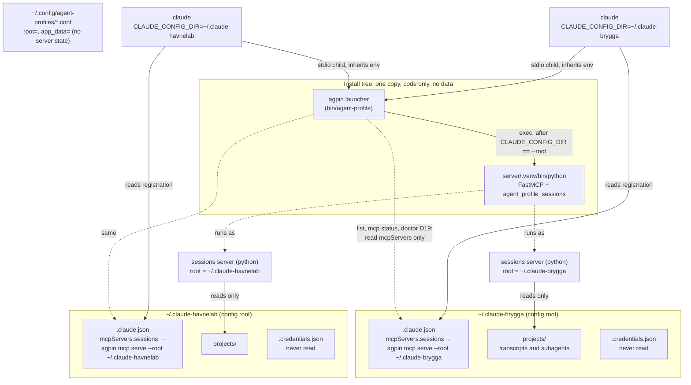
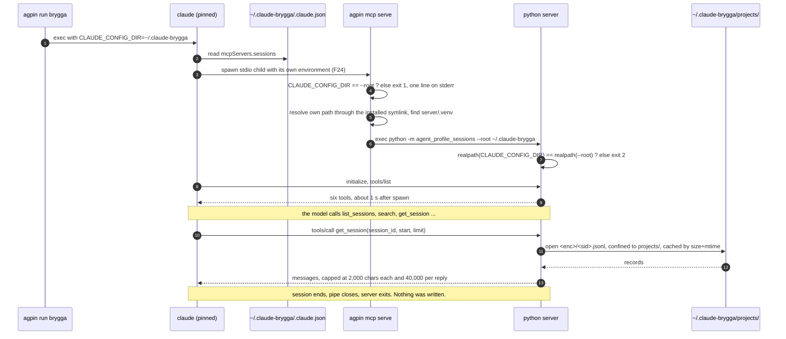
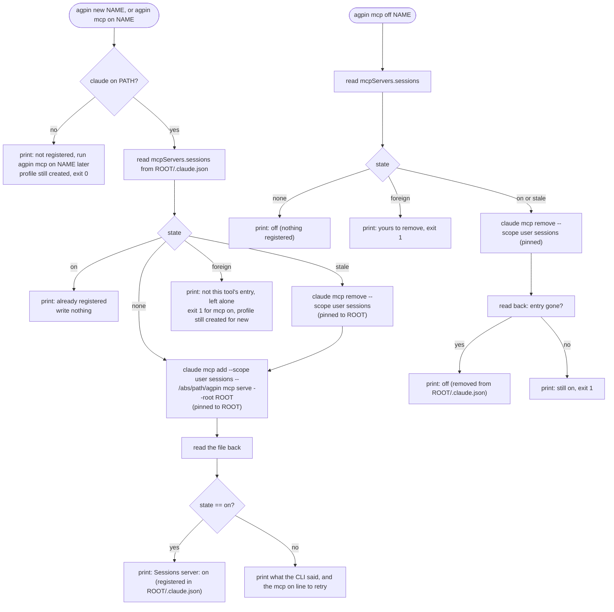
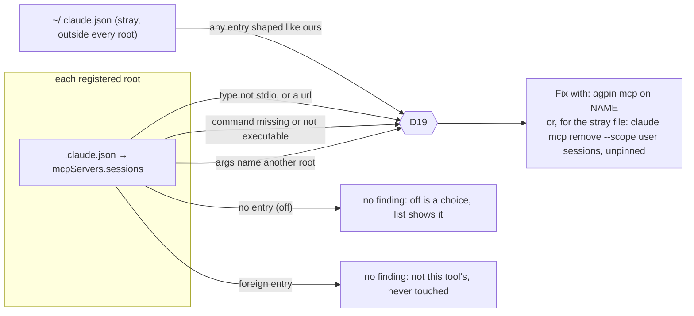

# Proposal: a sessions MCP server in every profile

> Give a Claude Code session structured, read-only access to the transcripts
> in its own profile's config root, through an MCP server that every profile
> gets registered at `new` time and that `agpin mcp on|off|status` controls.

**Status:** decided and implemented. The note was written first, with no
code, because the request collides with two rules this tool states
everywhere, adds a runtime and adds a third-party dependency, and all of that
was a decision before it was a patch. Markus took the recommendations in
sections 4 and 5 (registration through `claude mcp add` with `agpin mcp
serve` as the command, and the Python environment built at install time in
the tool's own tree), and
[#68](https://github.com/mmsge/agent-profile-manager/pull/68) implements
them: `server/`, `agpin mcp on|off|status|serve`, `doctor` D19, the installer
and formula changes, and the rewording in section 7. The argument below is
kept as written, so the reasoning behind each choice stays readable next to
the code that made it.

Written on 2026-09-15 against Claude Code **2.1.272**, on Linux. Everything
marked verified below was verified there, with a throwaway config root, and
is not the same as verified on a Mac. The three new entries in
[FACTS.md](../FACTS.md), F23 to F25, record the observations and say how to
repeat them on macOS.

The companion issue is
[#67](https://github.com/mmsge/agent-profile-manager/issues/67), which
offers the options below with a recommendation and carries the
implementation prompt for whatever is decided there.

## What was asked, and what is already decided

The request, verbatim: "I want all profiles to include an MCP server for
accessing the chat sessions in the profile. They should be structured in such
a way that they are easy to get a hold of with simple querying. If possible
the MCP server should be automatically included in the profile when created,
with a simple cli command for turning it on or off."

Three decisions were taken before this note was written. They are not
reopened here, but each has a cost and the cost is stated where it lands.

1. **A design note and an issue first, no code.** This document.
2. **The server runs on FastMCP**, the Python framework. Not stdlib-only
   python3, not bash, not the Go rewrite of #15. The open questions are how a
   coworker's Mac gets it installed and how this tool references it.
3. **Every profile gets the server registered at `new` time, adopted roots
   included.** Not only freshly created roots, and not opt-in.

## The recommendation in one screen

- **One server per root, started by the root's own Claude Code.** The server
  reads `CLAUDE_CONFIG_DIR` from the environment Claude Code gives it, which
  it verifiably inherits (F24), and serves `<root>/projects/` and nothing
  else in the root.
- **Registered through Claude Code's own CLI**, `claude mcp add --scope user`,
  pinned to the root, which puts one `mcpServers.sessions` entry into
  `<root>/.claude.json` (F23). `new` does this on the created path and the
  adopted path alike. `agpin mcp on|off` wrap add and remove. `agpin mcp
  status` and `agpin list` read the state file back the way `doctor` D02
  already does, and no registry key is added, because the state file is the
  only truth and a second copy would drift.
- **The registration names this tool, not a Python path.** Its command is the
  absolute path of the installed `agpin` link and its arguments are
  `mcp serve --root <root>`. `mcp serve` refuses to start unless
  `CLAUDE_CONFIG_DIR` equals `--root`, then execs the server's interpreter
  from the tool's own install tree. No version, no interpreter path and no
  cache path ever lands in a root, so upgrades need no re-registration and a
  registration copied into the wrong root fails loudly instead of serving the
  wrong transcripts.
- **The Python environment is built once at install time**, in the tool's own
  tree, from dependency hashes that ship inside the signed release tarball.
  Homebrew does it with its standard Python resource mechanism, and
  `tools/install.sh` does it with `uv` when present and `python3 -m venv`
  otherwise. Session start then costs about one second and no network.
- **No index.** A cold scan of a thousand invented transcripts takes 0.12 s
  for a listing and 1.5 s for a full parse in python3, so the server scans
  on demand and keeps whatever it caches in memory for the life of the
  process. Nothing is written inside a root by the server, ever.
- **Previews by default, text on request, caps everywhere.** Listing tools
  return metadata and a short first-prompt preview. Transcript text comes
  only from `get_session` with an explicit record range, truncated per
  message, with tool results and thinking excluded unless asked for, under a
  hard per-call size. `history.jsonl`, `paste-cache/`, `file-history/`,
  `shell-snapshots/`, auto memory and the OAuth fields of the state file are
  never read.
- **Not a plugin, for now.** A plugin from a marketplace would carry the
  server, but it adds a network fetch at `new` time and a second, unsigned
  distribution channel beside the release tarball, and it solves none of the
  runtime question. If #22 settles on its option 3, the sessions server should
  ride the same baseline plugin, and section 4 says what changes.
- **The rules change, and the change is small enough to write down.** "No
  exceptions" in [DESIGN.md](../DESIGN.md) gains one named exception, one
  isolation test case is renegotiated and the rest keep passing unchanged.
  Section 7 has the wording.

The rest of this document is the argument for each of those, with the
numbers, and with the alternatives that lost.

## How it works, end to end

Two profiles on one Mac, `brygga` and `havnelab` (two invented customers of
the README's example user), each with a session open.
Everything above the dotted line is code and is shared the way the bash
script itself is shared. Everything below it is data, and nothing below the
line is shared by anything.

```
              the tool's install tree: one copy, code only, no data
  +---------------------------------------------------------------------+
  |  /opt/homebrew/bin/agpin  ->  libexec/bin/agent-profile             |
  |  libexec/server/.venv/bin/python  (FastMCP, agent_profile_sessions) |
  +---------------------------------------------------------------------+
  ~/.config/agent-profiles/{brygga,havnelab}.conf    (root=, no server state)
 . . . . . . . . . . . . . . . . . . . . . . . . . . . . . . . . . . . . . .

  ~/.claude-brygga/                       ~/.claude-havnelab/
  |-- .claude.json                        |-- .claude.json
  |     mcpServers.sessions:              |     mcpServers.sessions:
  |       agpin mcp serve                 |       agpin mcp serve
  |         --root ~/.claude-brygga       |         --root ~/.claude-havnelab
  |-- .credentials.json  (never read)     |-- .credentials.json  (never read)
  |-- settings.json, skills/, ...         |-- settings.json, skills/, ...
  `-- projects/      <== the only         `-- projects/      <== the only
        <enc-cwd>/       directory the          <enc-cwd>/       directory the
          <sid>.jsonl    server opens             <sid>.jsonl    server opens
          <sid>/subagents/                        <sid>/subagents/

        ^ reads                                 ^ reads
        |                                       |
  [python sessions server]                [python sessions server]
        ^ exec, after checking                  ^ exec, after checking
        |   CLAUDE_CONFIG_DIR == --root         |   CLAUDE_CONFIG_DIR == --root
  [agpin mcp serve --root <brygga>]       [agpin mcp serve --root <havnelab>]
        ^ stdio child, inherits the             ^ stdio child, inherits the
        |   parent's environment (F24)          |   parent's environment (F24)
  [claude, CLAUDE_CONFIG_DIR=<brygga>]    [claude, CLAUDE_CONFIG_DIR=<havnelab>]
        ^                                       ^
  agpin run brygga, agpin shell brygga    agpin run havnelab, a desktop applet
```

### The same picture, as diagrams

GitHub renders these; a terminal reader has the text picture above and the
prose below.

#### The pieces, and what talks to what



Above the install tree there is one copy of the code, the same way there is one copy of the bash script. Below it, each root owns its own registration, its own transcripts and its own server process. No line crosses from one root to the other.

#### A session starting



#### What `new`, `mcp on` and `mcp off` do to a root



Every write goes through Claude Code's own CLI, pinned to the root, and every claim is read back from the file before it is printed. `mcp status`, `list` and `doctor` read the same block and write nothing.

#### What the launcher decides

```mermaid
flowchart TD
    A([claude starts: agpin mcp serve --root ROOT]) --> B{CLAUDE_CONFIG_DIR set<br/>and equal to ROOT?}
    B -- no --> R1["stderr: refusing to start: CLAUDE_CONFIG_DIR is X, --root is ROOT<br/>exit 1, shows as failed in /mcp"]
    B -- yes --> C{AGENT_PROFILE_SERVER_PYTHON<br/>set?}
    C -- yes --> E
    C -- no --> D["resolve $0 through symlinks,<br/>tree = dirname/.., python = tree/server/.venv/bin/python"]
    D --> E{interpreter executable?}
    E -- no --> R2["stderr: the sessions server is not installed<br/>run tools/install.sh again, exit 1"]
    E -- yes --> F["PYTHONPATH=tree/server exec python -m agent_profile_sessions --root ROOT"]
    F --> G{python: realpath(CLAUDE_CONFIG_DIR)<br/>== realpath(ROOT)?}
    G -- no --> R3["stderr: refusing to start, exit 2"]
    G -- yes --> H["serve over stdio, reading ROOT/projects only"]
```

The pin and the server's scope are the same variable in the same process tree. A registration copied into another root fails at the first diamond; a state file restored into the wrong place fails there too; a missing environment fails at the third, with the command that fixes it.

#### How doctor sees it



### What happens at session start

1. `agpin run brygga` execs `claude` with `CLAUDE_CONFIG_DIR=~/.claude-brygga`
   in its environment, exactly as today. Nothing about the launch changes.
2. Claude Code reads its own state file, which because of the variable is
   `~/.claude-brygga/.claude.json` (F10), finds `mcpServers.sessions` there,
   and spawns it as a child process over stdio. The child gets the parent's
   environment, so it arrives with `CLAUDE_CONFIG_DIR=~/.claude-brygga` set
   (F24).
3. The child is `agpin mcp serve --root ~/.claude-brygga`. It compares the
   variable with `--root`. They agree, so it locates the server's interpreter
   in its own install tree and execs it. Had they disagreed, or had the
   variable been unset, it would have exited with one line on stderr and
   Claude Code would show the server as failed in `/mcp`.
4. The Python server resolves `--root`, opens nothing but `projects/` beneath
   it, and answers `initialize` and `tools/list`. About one second after step
   2, the session has six tools: `list_projects`, `list_sessions`,
   `session_summary`, `get_session`, `get_message` and `search`.
5. The server lives as long as the session. It caches what it has parsed in
   memory, keyed by path, size and modification time, and re-reads a file
   only when those change, so it can answer about the conversation it is
   part of. When the session exits, Claude Code closes the pipe and the
   server exits. Nothing was written anywhere.

### What a session sees

Asked "what did we decide about retries in the billing repo last week", the
model would typically call `list_sessions(cwd="/Users/alex/src/billing",
since="2026-09-08")`, get back a page of session rows with a 200-character
first-prompt preview each, call `search("retry", cwd=...)` to get pointers
into specific records, and then `get_session(session_id, start=40,
limit=20)` to read the twenty messages around the hit, each cut at 2,000
characters, tool results and thinking left out. Every reply is capped at
40,000 characters, which stays under the point where Claude Code starts
warning about tool output size. Nothing returns a whole transcript in one
call, and nothing takes a path.

### How the profiles stay separate

Separation is not one mechanism, it is five, and each one holds on its own.

1. **The registration lives inside the root.** It is one key in
   `<root>/.claude.json`, the state file that moves under `CLAUDE_CONFIG_DIR`
   (F10). A Claude Code pinned to `brygga` reads brygga's state file and can
   only ever find brygga's registration. There is no global list of servers
   that both profiles read.
2. **The server is told its root by the same variable that pinned the
   session.** Claude Code spawns stdio servers with its own environment
   (F24), so the server inherits `CLAUDE_CONFIG_DIR` from the process that
   is itself pinned by it. The pin and the server's scope cannot come apart,
   because they are the same variable in the same process tree.
3. **The registration also names the root, and the launcher checks both.**
   `--root` is written into the registration at `new` time, and `mcp serve`
   refuses to start unless it equals `CLAUDE_CONFIG_DIR`. That covers the
   case the second mechanism does not: a state file copied or restored into
   the wrong root. It fails visibly instead of serving the wrong account's
   transcripts.
4. **The server reads one directory and takes no paths.** It opens
   `<root>/projects/` and nothing else in the root, checks every path it
   opens is still inside `projects/` after symlink resolution, and no tool
   accepts a path, a root or a session directory. The credential, the OAuth
   block of the state file, `history.jsonl`, the paste cache and the file
   history are unreachable by construction, not by policy.
5. **stdio only, one server per session.** The server is a child process
   with a pipe to exactly one Claude Code. There is no port, no socket and
   no HTTP transport compiled in, so a session in `havnelab` has no way to
   reach brygga's server even if it wanted to. Two sessions in the same
   profile get two servers, each read-only, with no shared cache between
   them.

What is shared is the code: the `agpin` launcher and the Python environment
in the tool's install tree, in the same way the bash script is one file
that every profile runs. No data, no index and no cache lives outside a
root, and nothing lives inside a root that came from another root. The
registry under `~/.config/agent-profiles/` holds no server state at all;
`agpin mcp status` and `agpin list` read the answer back out of each root's
own state file.

Two edges are worth naming. An unpinned `claude` reads `~/.claude.json`,
the stray state file beside the default root, and finds no `sessions`
entry there unless someone registered one; if someone did, the `doctor`
rule reports it, because a server serving the default root is a server
serving whatever leaked into it. And the desktop app's embedded Claude Code
honours the variable (F01) and so should read the pinned root's
registration, but whether it starts user-scope MCP servers from it has not
been observed and is listed as unverified below.

### The lifecycle

| Moment | What happens | What is written, and where |
| --- | --- | --- |
| `agpin new brygga` | Creates the root, then runs `claude mcp add --scope user sessions -- <agpin> mcp serve --root <root>` pinned to it. On an adopted root, checks first that no other `sessions` entry is there. Without `claude` on `PATH`, registers nothing and prints the `mcp on` line to run later | `<root>/.claude.json`, by Claude Code's own CLI, plus what a first CLI run leaves in a root (F23) |
| `agpin mcp status brygga`, `agpin list` | Reads `mcpServers.sessions` back and prints `on`, `off` or `stale` | Nothing |
| `agpin mcp off brygga` | `claude mcp remove --scope user sessions` pinned to the root, then reads the file back to confirm the entry is gone | `<root>/.claude.json`, by the CLI |
| `agpin mcp on brygga` | The same `add` as `new` runs. Idempotent | The same |
| `brew upgrade agpin`, or `tools/install.sh` again | Rebuilds the Python environment in the new version's tree. The launcher link keeps its path, so every registration stays valid untouched | The install tree only |
| `agpin doctor` | The new rule reports a registration whose `--root` is another profile's, whose command is missing or not this tool's, whose transport is not stdio, or one sitting in the stray state file | Nothing |
| `agpin remove brygga --purge` | Deletes the root, and the registration with it. Nothing else to clean, because nothing else was written | The root, as today |

### When it fails

| Failure | What you see | Why it is safe |
| --- | --- | --- |
| `claude` not on `PATH` at `new` time | `new` succeeds and prints the `agpin mcp on <name>` line | The profile exists and works without the server |
| The Python environment is missing or broken | `mcp serve` exits non-zero naming the install command; `/mcp` lists the server as failed | The session runs without the tools, nothing else is affected |
| `--root` and `CLAUDE_CONFIG_DIR` disagree | The same failed state in `/mcp`, with the reason on stderr | The wrong account's transcripts are never opened |
| Claude Code changes the record format | Listings shrink or empty; `verify` F11 already reports the `cwd` field going missing, and the server skips records it cannot parse | A parse failure is silence, never a crash and never a write |
| A transcript contains hostile text | The model may read it through `get_session`; caps limit how much per call, tool results and thinking stay out unless asked for, and the server has no write, network or shell tool | The blast radius is one profile's `projects/`, read-only. Anything beyond that has to go through another tool, where Claude Code's permission model applies |

## 1. The data

### Where sessions live

A session is one file, `<root>/projects/<encoded-cwd>/<sessionId>.jsonl`,
one JSON record per line (F11, F12). The directory name is the working
directory with every non-alphanumeric character replaced by `-`, which cannot
be decoded, and `CLAUDE_CODE_PROJECT_DIR_NAME` can replace it with an
arbitrary word (D08). So the server, like D03, keys projects by the `cwd`
field inside the records and treats the directory name as an opaque
container.

Beside the transcript, a directory named after the session id can hold two
things (F25): `subagents/agent-<id>.jsonl` with an `agent-<id>.meta.json`
beside each, one per subagent the session ran, and `tool-results/`, where
large tool outputs are spilled to files instead of being kept inline. The
documentation lists both under the retention sweep together with the
transcript
([.claude directory](https://code.claude.com/docs/en/claude-directory)).

Transcripts age out. The sweep deletes them after `cleanupPeriodDays`, 30 by
default, so unless a profile has raised that setting the server sees a
rolling month. That is a property of the data, not of the server, and the
server should say so in its `list_projects` output rather than let "no
sessions from June" read as a bug.

The documentation also says, in as many words, that the record format "is
internal to Claude Code and changes between versions, so scripts that parse
these files directly can break on any release"
([sessions](https://code.claude.com/docs/en/sessions)). This tool already
lives with that for D03, and `verify` checks F11 for exactly that reason. The
server has to be written the same way: unknown record types are skipped,
missing fields are tolerated, and a change that empties every listing is
reported by `verify` rather than discovered by a user.

### What a record is

Every record has a `type`. Observed in a real 2.1.272 transcript, by key
names only: `user`, `assistant`, `attachment`, `system`, `queue-operation`,
`custom-title`, `last-prompt`, `mode`, and on the hosted environment this was
written in, `atis-latch`. The four that carry conversation state, `user`,
`assistant`, `attachment` and `system`, all carry `sessionId`, `timestamp`,
`cwd`, `gitBranch`, `version`, `uuid`, `parentUuid` and `isSidechain`. `user`
and `assistant` carry `message`, whose `content` is either a string or a list
of blocks typed `text`, `thinking`, `tool_use` or `tool_result`.
`custom-title` carries `customTitle`. `last-prompt` carries `lastPrompt`.

Two things about `user` records matter for counting and for privacy. A tool's
output comes back as a `user` record whose content is a `tool_result` block
and which carries `toolUseResult`, so "user records" is not "things the
person typed". And `assistant` records carry `thinking` blocks, which are
never shown in the terminal and should not be handed back by default either.

### What identifies a session

| Field | Source | Cost to obtain |
| --- | --- | --- |
| `session_id` | The file name | Directory listing |
| `cwd`, `git_branch`, `version` | The first `user` or `assistant` record | Read the head of the file |
| `started_at` | Timestamp of that first record | Same read |
| `last_at` | Timestamp of the last `user` or `assistant` record | Read the tail of the file |
| `title` | The last `custom-title` record, when one exists | Full read, or none |
| `first_prompt` | The first `user` record with string content or a `text` block and no `toolUseResult`, truncated | Head of the file in practice |
| `prompts`, `replies`, `tool_calls` | Counts over `user`, `assistant` and `tool_use` | Full read |
| `has_subagents` | Whether `<sessionId>/subagents/` exists | Directory listing |
| `size_bytes` | `stat` | Directory listing |

Section 3 measures what each column costs. Where the generated title lives,
the one the session picker shows when nobody ran `/rename`, was not observed
in the transcript and is left `UNVERIFIED`; the server reports `title` only
when a `custom-title` record supplies one.

### What a subagent sidechain is

A subagent runs in its own context and writes its own transcript,
`<sessionId>/subagents/agent-<id>.jsonl`. Its records carry the same fields
as the parent's plus `agentId`, and `isSidechain` distinguishes them from the
main line. The parent transcript keeps the link in the other direction: the
`user` record that carries the subagent's result has a `toolUseResult` naming
`agentId` and `agentType`. So a subagent transcript is a child of exactly one
session, it is paged like any other transcript, and the server should expose
it as `get_session(session_id, agent_id=...)` rather than as a session of
its own, which is also how the retention sweep treats it.

### What else in a root is session-shaped, and whether it belongs

| Path | What it is | In the server? |
| --- | --- | --- |
| `projects/<enc>/<id>.jsonl` and `<id>/subagents/` | The transcripts | Yes, the whole scope of v1 |
| `projects/<enc>/<id>/tool-results/` | Spilled tool outputs the transcript refers to | Only through `get_message` on the record that refers to one, capped, never listed on its own |
| `projects/<enc>/memory/` | Auto memory the agent writes for itself | No. A different feature, and not a session |
| `plans/` | Plan-mode documents in prose | Not in v1. The one candidate for a later `list_plans`, because a plan is exactly what someone comes back for |
| `history.jsonl` | Every prompt ever typed, with timestamp and project path, kept until deleted | No. It outlives the retention sweep and it is the most concentrated file in the root |
| `sessions/` | One small file per running session, with a pid | No. It is liveness, not history |
| `tasks/` | Task lists from the task tools | No |
| `session-env/`, `shell-snapshots/` | Per-session environment and a dump of the shell's aliases and functions | No, and the snapshot is a shell environment, which is a place secrets end up |
| `file-history/` | Pre-edit copies of files the agent changed | No. That is customer code |
| `paste-cache/`, `image-cache/`, `uploads/` | Large pastes, attached images and uploads | No. A paste is the likeliest place for a credential |
| `todos/` | Legacy, no longer written | No |
| `.claude.json` | The state file, with `oauthAccount`, `mcpServers` and per-project trust | Not by the server. The tool reads `mcpServers` for `mcp status`, read-only, and nothing else |
| `.credentials.json` | The credential | Never, by anything |

The line is drawn at "what the person said and what the agent said back". A
useful second version could add plans. Nothing else in that table should be
reachable through a tool the model can call.

## 2. The query surface

"Easy to get a hold of with simple querying" is the requirement, and the
counter-requirement is that a tool which returns whole transcripts to the
model is a prompt-injection amplifier: a transcript is text other sessions
wrote, some of it pasted from customer systems, and every byte of it that
reaches the model is an instruction the model may follow. So the surface is
built as previews first, text on request, and a cap on everything.

Six tools. Arguments are shown with their defaults. Every tool takes no path
and no root: the server has one root, given at start, and nothing a caller
sends can change it.

**`list_projects()`**

Returns one row per distinct `cwd`, with the encoded directory name it was
found under, the session count, the newest `last_at`, and the retention
window the root is under when the server can read `cleanupPeriodDays` from
`<root>/settings.json`. Nothing here is transcript text.

```json
{"projects": [{"cwd": "/Users/alex/src/billing", "dir": "-Users-alex-src-billing",
               "sessions": 14, "last_at": "2026-09-14T15:02:11Z"}],
 "retention_days": 30, "root_note": "transcripts older than retention_days are deleted by Claude Code"}
```

**`list_sessions(cwd=None, since=None, until=None, branch=None, query=None, limit=20, cursor=None)`**

Filters by project, ISO date range on `last_at`, git branch, and an optional
case-insensitive substring over the first prompt and title only. Returns the
identity columns from section 1, newest first, with `first_prompt` cut at 200
characters. `limit` is capped at 100. Counts are included, because a page of
a hundred sessions costs a full read of a hundred files, which section 3
measures at well under a second.

```json
{"sessions": [{"session_id": "…", "cwd": "/Users/alex/src/billing", "git_branch": "main",
               "started_at": "…", "last_at": "…", "title": null,
               "first_prompt": "Add a retry to the invoice fetcher and…",
               "prompts": 12, "replies": 31, "tool_calls": 58, "has_subagents": true,
               "size_bytes": 412903}],
 "next_cursor": null}
```

**`session_summary(session_id)`**

Everything `list_sessions` returns for one session, plus: the last assistant
text cut at 500 characters, a histogram of tool names used, the distinct file
paths that appeared as `file_path` in `tool_use` inputs, the list of
subagents with their `agentType`, and the record count. No language-model
summary, because the server has no model, and the point of the tool is that
the caller gets enough to decide whether to open the session at all.

**`get_session(session_id, agent_id=None, start=0, limit=50, roles=["user","assistant"], include_tool_results=False, include_thinking=False, max_chars=2000)`**

The only tool that returns conversation text, and it returns it by record
range. Each returned item is one message: its index, `uuid`, timestamp, role,
text with every `text` block joined and cut at `max_chars`, the names of any
`tool_use` blocks, and a `truncated` flag. Tool results and thinking are
absent unless asked for by name. `limit` is capped at 100 and the whole reply
is capped at 40,000 characters, after which the tool stops early and says
where. `agent_id` pages a subagent transcript the same way.

**`get_message(session_id, uuid, agent_id=None, max_chars=20000)`**

One record, untruncated up to a hard cap, for the case where the caller
needs the whole of one tool result or one long reply. This is the explicit
ask. It never follows a `tool-results/` reference unless
`include_spilled=True`, and then it applies the same cap.

**`search(query, cwd=None, since=None, until=None, branch=None, roles=["user","assistant"], regex=False, limit=20)`**

Case-insensitive substring by default, Python `re` on request with the
pattern length capped, over the text of the selected roles. Returns hits as
`session_id`, record index, timestamp, role and a snippet of 240 characters
around the match. `limit` is capped at 50. A hit is a pointer into
`get_session`, not a transcript.

Two conventions apply to all of them. Every item of text the server returns
is wrapped in a structure whose `source` field says `transcript`, so a
downstream consumer can tell data from tool metadata, and the tool
descriptions themselves say that transcript text is data written by earlier
sessions and not instructions. Claude Code adds its own ceiling above these:
it warns at 10,000 tokens of tool output and cuts at 25,000
([mcp](https://code.claude.com/docs/en/mcp)), and the caps above are chosen
to stay under the warning.

Nothing writes. There is no `delete_session`, no `rename`, no `export`, and
there should not be: this tool's rule that it never edits the agent's own
state files applies to the server it ships with.

## 3. Indexing

The question is whether the server scans `projects/` on demand or keeps an
index, and if an index, where. Both homes for an index are bad. Outside the
root is shared state across profiles, which the design forbids without
exception. Inside the root is the server writing into a root, a thing this
tool has never done and section 7 has to renegotiate for one small
registration already.

So the measurement was made before the design. An invented fixture set was
generated in the scratchpad, with the record shapes from section 1 and
nonsense text, and scanned with plain python3, no third-party parser:

| Fixture | Size | Listing by `stat` only | Head and tail read per file | Full parse, every record | Substring search, every record |
| --- | --- | --- | --- | --- | --- |
| 400 sessions, 200 records each | 144 MB | 0.002 s | 0.05 s | 0.59 s | 0.22 s |
| 1000 sessions, 200 records each | 359 MB | 0.004 s | 0.12 s | 1.50 s | 0.54 s |

Measured on 2026-09-15 on the Linux box this was written on, warm page cache,
python3 3.11. A Mac laptop with an SSD is in the same order. The README's own
example root holds 412 sessions after an engagement, so the first row is a
real profile and the second is a large one.

The conclusion is that no index is needed. `list_sessions` at a hundred per
page costs a tenth of a second from a cold start, and a full parse of
everything, which is what `search` and the counts need, is a second or two
once per process. The server runs for the life of the Claude Code session
that started it, so it caches what it has parsed in memory, keyed by path,
size and modification time, and re-reads a file only when those change. The
transcript of the running session changes constantly and is re-read on
demand, which is correct: the caller can ask about the conversation it is in.

Nothing is written. If a root ever grows to a size where this stops holding,
the right answer is still not an index on disk. It is a `projects/` listing
that is paged and a search that is bounded by `since`, both of which the
surface already has.

## 4. Registration

### What `new` does

`new` runs, pinned to the root it just created or adopted:

```sh
CLAUDE_CONFIG_DIR=/Users/alex/.claude-brygga claude mcp add --scope user sessions -- /opt/homebrew/bin/agpin mcp serve --root /Users/alex/.claude-brygga
```

Verified (F23): that writes one entry into `<root>/.claude.json`,

```json
{"mcpServers": {"sessions": {"type": "stdio", "command": "/opt/homebrew/bin/agpin",
                              "args": ["mcp", "serve", "--root", "/Users/alex/.claude-brygga"],
                              "env": {}}}}
```

and prints `File modified: <root>/.claude.json`. `--scope user` is the right
scope and the only right one: `--scope local` lands under
`projects[<cwd>].mcpServers` keyed by the working directory the command ran
in, and `--scope project` writes `.mcp.json` into that working directory,
which would be shared with every profile and everyone else on the
repository. `claude mcp remove --scope user sessions` takes the entry back
out, leaving `"mcpServers": {}`.

Three things `new` now requires or does that it did not before, each of
which the isolation tests notice:

1. **`claude` on `PATH`.** `new` has never needed the agent installed. When
   it is missing, `new` must still create and register the profile, print
   that the sessions server was not registered and the `agpin mcp on <name>`
   line to run later, and exit zero. A fresh Mac may well get `agpin` before
   it gets `claude`.
2. **It starts the agent binary.** This is the D16 class of act the design
   notes name: an audit reads the filesystem and asks the Keychain about
   named services, and starting a binary to get an answer is different. Here
   the alternative is worse. Writing the JSON ourselves means merging a key
   into a file Claude Code owns, rewrites and keeps five backups of, which is
   the exact thing the `statusline install` paragraph in DESIGN.md refuses to
   do. Using the CLI keeps the tool out of the file format and puts the write
   on the same code path Claude Code uses itself.
3. **The root is not empty afterwards.** Running the CLI created `backups/`,
   `policy-limits.json`, `policy-limits.json.stamp.json` and
   `remote-settings.json` beside `.claude.json` in a root nobody had logged
   in to (F23). The documentation describes the last two as fetched caches,
   so `new` may now cause Claude Code to make a network request, and on the
   hosted environment this was verified in, the state file also gained an
   `oauthAccount` block, supplied from that environment rather than from a
   login. Both of those are `UNVERIFIED` on a Mac and the FACTS entry says
   what to look for. The consequence for this tool is concrete: `list`
   reads `oauthAccount` to name a root's account, and it must not report an
   account for a root nobody has logged in to.

### `mcp serve`, and why the registration names this tool

The registration could name the Python interpreter directly. It names
`agpin` instead, for four reasons.

- **No version in the root.** An interpreter path under
  `~/.local/share/agent-profile/0.11.0/` or `/opt/homebrew/Cellar/agpin/0.11.0/`
  goes stale at the next upgrade, and every root would need re-registering.
  The launcher link, `~/.local/bin/agpin` or `/opt/homebrew/bin/agpin`, is
  stable across versions on both install channels.
- **A check before anything runs.** `mcp serve` compares `--root` with
  `CLAUDE_CONFIG_DIR` and exits non-zero with one line on stderr if they
  differ or the variable is unset. A registration that was copied into
  another root, or a state file restored into the wrong place, then fails
  visibly in `/mcp` instead of serving one account's transcripts to another.
  It is the cheapest defence in depth available and it needs no Python.
- **Both channels, one launcher.** `mcp serve` resolves its own install tree
  the way `resolved_self` already does for `guard`, finds
  `<tree>/server/.venv/bin/python` there, and execs it. Where the environment
  lives is the installer's business, not the root's.
- **One place to grow.** When #15 lands, the Go binary keeps `mcp serve` and
  nothing in any root changes.

The cost is bash in the start path. `bin/agent-profile` parses in tens of
milliseconds under bash 3.2, which the fast path for `which --label` exists
to avoid in a prompt; `mcp serve` should sit in that same early block so it
pays for two string comparisons and an `exec`, against a server that takes
the better part of a second to come up anyway (section 5).

### `mcp on`, `mcp off`, `mcp status`

```
agpin mcp on <name>       claude mcp add --scope user, pinned to the profile's root; idempotent
agpin mcp off <name>      claude mcp remove --scope user, pinned the same way; idempotent
agpin mcp status [name]   reads <root>/.claude.json and prints on, off or stale, with the reason
```

`list` gains a column with the same three words. `status` and `list` are
read-only and read only the `mcpServers` block, the way D02 reads only
`oauthAccount`. "Stale" means an entry exists whose `--root` is not this
profile's root, whose command does not exist, or whose command is not this
tool's launcher, and it is also what the `doctor` rule in section 6 reports.

**No registry key.** The obvious design is `mcp=on` in
`~/.config/agent-profiles/<name>.conf`, and it is wrong for the reason
`which --label` is derived rather than stored: a second copy of a fact
drifts from the first. The state file is where Claude Code reads the
registration from, so it is the only place worth reading it back from. If
Markus later wants "the state Markus wants" recorded separately from "the
state Claude Code has", that is a `doctor` finding when they differ, not a
registry key.

**What `off` guarantees.** After `mcp off <name>`, the `sessions` entry is
absent from `<root>/.claude.json`, which the command reads back and asserts
before it says so. Nothing else in the root was touched, because nothing
else was written. No shared state exists to clean up, because there is none.
The next session started in that root starts no server. What `off` does not
do is stop a server already running inside an open session; that one lives
until the session exits, and the command says so. `off` does not use
Claude Code's `disabledMcpServers` list, which is per project and keeps the
configuration, because "off" here has to mean gone, not hidden.

### The plugin alternative, and #22

Issue #22 recommends publishing a company baseline as a Claude Code plugin in
a private marketplace, so that each root installs its own copy through
Claude Code's own mechanism and the tool never copies a file between roots.
A plugin can carry an MCP server: `.mcp.json` at the plugin root with
`${CLAUDE_PLUGIN_ROOT}` for its paths, started automatically when the plugin
is enabled, installed with `claude plugin install <plugin>@<marketplace>`
which defaults to `--scope user`, and recorded in `<root>/settings.json`
([plugins reference](https://code.claude.com/docs/en/plugins-reference)).
The shape is the same as this proposal's: `new` runs the agent's CLI pinned
to the root, and the root ends up with one registration of its own.

It is not recommended for this feature on its own, for three reasons.

- **It adds a network fetch at `new` time** that the `claude mcp add` route
  does not need. A marketplace is a git repository Claude Code clones into
  `<root>/plugins/cache`, so `new` on a train fails, and the failure mode of
  a profile with no sessions server is silent.
- **It is a second distribution channel, and an unsigned one.** The release
  tarball is signed under its tag and the installer verifies it (see the
  README's release section). A marketplace plugin is a commit in a
  repository, and nothing in the current release machinery signs or pins it.
  Shipping the server in the tarball keeps one channel and one signature.
- **It changes nothing about the runtime.** The plugin's `.mcp.json` still
  has to name an interpreter with FastMCP installed, and `${CLAUDE_PLUGIN_ROOT}`
  gives it a path inside the root's plugin cache, which is a per-root copy of
  the Python source but not of its dependencies. Section 5 is unchanged.

If #22 goes to its option 3, the picture changes: there is then a baseline
plugin every root installs anyway, the marketplace is a cost already paid,
and the sessions server should be one more component of that plugin rather
than a separate registration. The `mcp serve` launcher survives that move
intact, because the plugin's `.mcp.json` would name `agpin mcp serve` exactly
as `claude mcp add` does now, and `mcp on|off` would become
`claude plugin enable|disable` pinned to the root. So the recommendation is
`claude mcp add` today, written so that the plugin route can replace it
without touching the server or the launcher.

## 5. Runtime and packaging on a fresh Mac

FastMCP is decided. What is not decided is how a coworker's Mac gets a
Python with FastMCP in it, what that costs on a machine with no developer
tools, how it updates and how it is verified against the release signature
the installer already checks.

### What FastMCP costs, measured

| Measurement, 2026-09-15, Linux, python3 3.11 | Value |
| --- | --- |
| `pip install fastmcp` (4.0.3) | 75 packages, 133 MB in the venv |
| `import fastmcp` | 0.35 s |
| A hello-world FastMCP server, spawn to `initialize` reply | 0.85 s |
| The same, to `tools/list` reply | 1.03 s |
| The same server through a warm `uvx --from fastmcp==4.0.3` | 1.0 s to `initialize`, 1.6 s on the first run after the cache was built |
| First `uvx` run with an empty cache | 2.5 s plus the download, 104 MB of cache |
| A bare `python3 -c pass` | 0.012 s |
| A stdlib-only JSON-RPC responder, spawn to `initialize` reply, for comparison | 0.017 s |

Two things follow. Claude Code starts every registered server at every
session start, so the decided framework taxes every session in every profile
by about a second, in parallel with whatever else is starting; that is the
price of decision 2 and it is stated here once. And `uvx` at session start
is the wrong place for a dependency resolver: it adds a network-dependent
first run and a cache to every session for nothing the install step cannot
do once. `fastmcp-slim[server]`, a lighter build the project publishes, was
not measured and may cut the import cost; the bare `fastmcp-slim` package
refuses to run a server at all.

Whatever runs the server should pass `show_banner=False` and a warning log
level: the default prints a banner and an info line to stderr on every
start, which is what `claude --debug` shows a user.

### The four ways a Mac gets it

| | `uvx` or `uv run` at session start | `pipx` | A venv the installer builds | A Homebrew dependency |
| --- | --- | --- | --- | --- |
| `mcpServers` command | `uvx --from agent-profile-sessions==0.11.0 …` or `uv run --project <tree>/server …` | `~/.local/bin/agent-profile-sessions` | `agpin mcp serve --root …`, which execs `<tree>/server/.venv/bin/python` | The same launcher, execing `#{libexec}/server/.venv/bin/python` |
| First run on a Mac with no developer tools | `uv` downloads a managed CPython, so no Command Line Tools dialogue; first session start waits on a download | `pipx` needs a `python3`, which on a fresh Mac opens the Command Line Tools dialogue | With `uv` present, as the first column; without it, `python3 -m venv` opens the dialogue, and the installer says so before it does | None. Homebrew's `python@3.13` is a bottle, and the formula's resources are downloaded and checked by `brew` at install |
| Updated by | Changing the pinned version in every root's registration, or `uv cache` churn if unpinned | `pipx upgrade`, separately from the tool | Re-running `tools/install.sh`, which rebuilds the venv for the new version tree | `brew upgrade agpin` |
| Verified against the release signature | Not at all. PyPI is a second source the tarball's signature does not cover | Not at all | Yes for the server source and the hash-pinned dependency list, which ship inside the signed tarball; the dependency bytes come from PyPI but must match the pinned hashes | Yes for the source; each resource carries its own `sha256` in the formula, which `brew` checks |
| New third-party dependency | `uv` | `pipx` | `uv` optional | None beyond what `brew` already is |

**Recommendation: build the environment once at install time, in the tool's
own tree, from hashes that ship in the signed release.** Concretely:

- The server's source lives in the repository at `server/`, with
  `pyproject.toml`, `uv.lock` and a generated `requirements.txt` carrying
  hashes, and its tests under `server/tests/` against generated fixtures
  like the ones in section 3. The tarball recipe in `release.yml` copies
  `bin tools docs`; it would copy `server` too, minus tests. The Homebrew
  formula's `libexec.install` list gains `server`.
- `tools/install.sh`, after unpacking and verifying the tarball, runs
  `uv sync --frozen` in `<version>/server` when `uv` is on `PATH`, and
  otherwise `python3 -m venv .venv && .venv/bin/pip install --require-hashes -r requirements.txt`,
  after printing that this may open the Command Line Tools dialogue. A
  failure here fails the install, before the launcher link is made, in the
  same "nothing was installed" style the signature check uses. The `--dev`
  install runs the same step in the checkout.
- The Homebrew formula declares `depends_on "python@3.13"` and one `resource`
  block per dependency with its `sha256`, generated with
  `brew update-python-resources`, and builds the venv with
  `virtualenv_install_with_resources` into `libexec/server/.venv`. That is
  Homebrew's standard shape for a Python tool and `brew audit` knows it.
- `agpin mcp serve` finds `<tree>/server/.venv/bin/python` relative to its
  own resolved path and execs it with `-m agent_profile_sessions --root …`.
  If the venv is missing it exits non-zero naming the install command to
  run, which `/mcp` then shows.

Session start then costs the 0.85 s the framework costs and nothing else,
with no network, and the failure of a missing runtime happens at install
time where a person is watching. The price is a heavier install step on the
tarball path, a formula with a few dozen resource blocks that the
`homebrew-formula.yml` workflow does not yet regenerate, and a release
process that has to refresh the lockfile and the resource list together
whenever the server's dependencies move. The runner-up is `uv run --frozen`
at session start against the same lockfile, which removes the install-time
step at the cost of a first-session download and `uv` as a hard dependency.

**The Go rewrite (#15) does not change this.** The server is a separate
process either way. A Go binary would keep `mcp serve` as the launcher, and
whether the server itself is later rewritten in Go is a decision that can
wait until there is a Go tool to put it in.

## 6. Privacy and security

Transcripts are the most sensitive thing in a root after the credential:
customer code, pasted secrets, hostnames, and the account's own conversation
history, none of it encrypted at rest. The documentation says so directly:
"Transcripts and history are not encrypted at rest. OS file permissions are
the only protection." The server is a new reader of that data, started
automatically, and its design has to earn that.

**Scope of reading.** The server opens `<root>/projects/` and nothing else
in the root. Not `.credentials.json`, not the OAuth fields of `.claude.json`,
not `history.jsonl`, and none of the other paths section 1 rules out. It
resolves `--root` once, refuses a root that is not a directory, and checks
every path it opens is inside `projects/` after symlink resolution, so a
symlink planted under `projects/` cannot walk it out. The tool's own reading
of the state file, for `mcp status`, is the `mcpServers` block and nothing
else, and the isolation test that puts a canary credential in a root and
greps every document for it should gain the `mcpServers` output as one more
document to check.

**Transport.** stdio only. The server has no `--port`, no HTTP transport and
no listener, so there is nothing on the machine another process could
connect to. FastMCP offers HTTP transports; the server does not import them.

**Isolation between profiles.** This rests on F24: a stdio server started by
Claude Code inherits the pinned process's environment, `CLAUDE_CONFIG_DIR`
included, so the server sees the root its Claude Code sees. `mcp serve`
refusing to start when `--root` and the variable disagree closes the case
where a registration has wandered. Nothing the model can send changes the
root, because no tool takes a path.

**What one transcript can do to another.** The realistic attack is a
transcript that contains an instruction, whether pasted from a hostile web
page in an earlier session or planted in a customer repository, and a model
that reads it through `get_session` and follows it. The server cannot stop a
model from reading; that is the feature. What it limits is the reach: it has
no write tool, no network, no shell, and a blast radius of one profile's
`projects/`. Within that radius, the caps in section 2 keep any one call
from pulling a whole transcript, the defaults keep tool results and thinking
out unless asked for, and the tool descriptions label everything returned
as data. A model instructed by one transcript to exfiltrate another still has
to do the exfiltrating through some other tool in the session, which is where
Claude Code's own permission model applies. That is the honest boundary, and
the note says it rather than promising more.

**A `doctor` rule.** Yes, one, and it fits the audit's existing shape. The
next free number is D19, which #22 also claims for its guardrails rule;
whichever lands first takes it. It reads `mcpServers.sessions` from each
registered root's state file, command and args only, and reports a
registration whose `--root` is not that profile's root, whose command does
not exist, whose command is not this tool's launcher, or whose `type` is not
`stdio`. It also reports the same entry in the stray state file beside the
default root, which is D02's territory and means an unpinned run was given
one. A profile with no registration is not a finding, it is what `list`
shows as `off`; a rule that fires on a choice gets ignored. The declaration
for the generated "What doctor reads" table would read:

```
doctor reads (D19):
  The `mcpServers` block of each registered root's state file, and of the
  stray state file beside the default root: the `sessions` entry's command
  and arguments only, never the `oauthAccount` block or any other key.
```

**Adopted roots, on by default.** Markus rejected off-by-default for
adopted roots, and the cost is this. A live root has a `.claude.json` that
Claude Code owns, may be rewriting from an open session at the moment `new`
runs, and may already have a `sessions` entry meaning something else. `new`
on an adopted root therefore stops being the lossless act its own message
promises ("Nothing was copied, moved, seeded or removed"), because it now
adds one key to that file through the agent's CLI, which also rewrites the
file and rotates its backups. The mitigations are that the write goes through
Claude Code's own code path rather than ours, that `new` checks for an
existing `sessions` entry and refuses to replace one that is not this tool's
rather than overwriting it, and that the adopted-root message changes to say
exactly what was added. The residual cost is that an adopted root's first
`new` is a write into a live account's state, and that is stated here once
and not argued further.

## 7. What the tool's rules become

The shape above keeps the invariants that matter, no symlinks, no shared
files, no copying between roots, no reading of credentials, and gives up one
sentence: `new` no longer leaves a root untouched. The honest thing is to say
so in the places the rule lives.

### DESIGN.md, "Why nothing is shared"

The current paragraph:

> **No exceptions.** No symlinks, no shared parent directory, no copying
> common commands into every root, no seeding a new root from an existing
> one, no template of default settings. `new` creates an empty root.

Proposed:

> **No exceptions.** No symlinks, no shared parent directory, no copying
> common commands into every root, no seeding a new root from an existing
> one, no template of default settings. `new` copies nothing into a root from
> anywhere. The one thing it adds is a registration for the root's own
> sessions server, written by Claude Code's own CLI into the root's state
> file. It names this tool and this root and nothing else, it is the same
> shape in every root, and it points at nothing outside the root, so two
> roots still share no file and no content. `agpin mcp off` takes it out
> again.

And the last paragraph of that section:

> The tool also never touches credentials beyond checking that one exists,
> never edits the agent's own state files, and never migrates data between
> roots.

Proposed:

> The tool also never touches credentials beyond checking that one exists,
> never edits the agent's own state files by hand, and never migrates data
> between roots. The one change it makes to a state file, the sessions
> server registration, goes through `claude mcp add` and `claude mcp
> remove` pinned to the root, so the file is only ever written by the
> program that owns it.

### `new`, in `bin/agent-profile`

The comment "The root is created empty. Nothing is copied or seeded into it,
ever." becomes "Nothing is copied or seeded into the root from anywhere. The
one thing `new` adds, on the created path and the adopted path alike, is the
sessions server registration, through the agent's own CLI (docs/FACTS.md
F23)." The `--explain` text "The root is empty, which is the point" becomes
"The root holds nothing from any other profile, which is the point", and the
adopted-root message gains one line naming what was added to `.claude.json`.

### `tests/cases/50-isolation.sh`

| Case | Outcome |
| --- | --- |
| no symlinks under any root | Passes unchanged. The venv lives in the tool's tree, never in a root |
| a second profile inherits nothing | **Renegotiated.** It asserts the new root is empty, and it will not be. It becomes: the second root contains no entry the first root contains, its `settings.json` and `skills/` are absent, and its `.claude.json` names its own root and not the first's. The harness needs a stand-in `claude` on `PATH` that answers `mcp add`, `mcp remove` and `mcp get` by editing `$CLAUDE_CONFIG_DIR/.claude.json`, the way `40-verify.sh` and `80-install.sh` already use stand-in `claude` scripts |
| the registry lives outside every root | Passes unchanged. No registry key is added |
| the source never copies between roots | Passes unchanged. `new` calls a binary; it runs no `cp`, `ln -s`, `rsync` or `install -m` |
| the source never reads credentials | Passes unchanged |
| no command writes the agent state file | Passes unchanged as written, since it runs `list`, `doctor`, `verify` and `explain` after `new`. It should grow: `mcp status` added to that list, and a new case that `mcp on brygga` leaves `.claude-havnelab/.claude.json` byte-identical |
| no document carries a credential | Extend it: `mcp status --json` and the D19 finding join the documents checked for the canary |

New cases belong in `10-profiles.sh` for `new` with and without `claude` on
`PATH`, in `30-doctor.sh` for D19 firing and staying quiet, and in `95-docs.sh`
the generated table gains a row, which `tools/gen-doctor-reads.sh --check`
enforces on its own.

### Versioning

A new command and a new file in the tarball is a backwards-compatible
feature: `Y` moves, so this ships as 0.11.0 when it ships.

## What was verified, and what was not

Verified on Linux against Claude Code 2.1.272, 2026-09-15, in a throwaway
root, and recorded in FACTS.md:

- F23: `claude mcp add --scope user` pinned to a root writes `mcpServers`
  into `<root>/.claude.json`, and leaves the root non-empty.
- F24: a stdio MCP server started by a pinned Claude Code inherits
  `CLAUDE_CONFIG_DIR`, and the rest of the parent's environment.
- F25: subagent transcripts live under `projects/<enc>/<sessionId>/subagents/`
  and their records carry `agentId`.

Measured, not facts about Claude Code, and therefore in this note only: the
scan timings in section 3 and the FastMCP costs in section 5.

Not verified, and needing a Mac:

- Whether `claude mcp add` on a Mac, before any login, fetches
  `policy-limits.json` and `remote-settings.json` over the network, and
  whether it writes an `oauthAccount` block. F23 says what to look for.
- Whether the desktop app's embedded Claude Code starts the same
  `mcpServers` entries from `<root>/.claude.json` as the CLI does. F01 and
  F17 make it likely, and the desktop is where a slow server start is most
  visible.
- Where the generated session title lives on disk.
- The Homebrew resource build under `brew audit`, and `uv`'s managed Python
  download on a Mac with no developer tools.

## Decisions for Markus

1. **Registration through `claude mcp add` with `agpin mcp serve` as the
   command**, as section 4 recommends, or a plugin from a marketplace
   folded into #22.
2. **The runtime's home**: an environment built at install time in the tool's
   tree, as section 5 recommends, or `uv run` at session start.
3. **The rewording in section 7**, or a stricter line: keep "no exceptions"
   and make the server opt-in after all, which this note argues against
   only because decision 3 already settled it.
4. **Whether D19 is this rule or #22's**, since both want the number.
5. **Whether `plans/` joins the surface in v1** or waits.

If the answer to the first two is no to both, the honest alternative is to
say that a sessions server is a thing a profile's owner installs into that
root by hand, with a documented `claude mcp add` line, and that this tool
audits it with D19 but never writes it. That keeps every rule as written, at
the cost of the "automatically included" half of the request.
